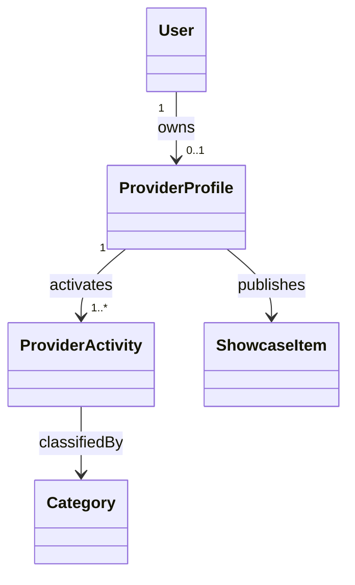

# نموذج نشاط المقدم — Provider Activity Model

> **الحالة:** `ANALYZED_APPROVED — SYNCHRONIZED 2026-09-04`
>
> **أساس القرارات:** DEC-029/030/034/035/041/043/064.

## 1. القرار الأساسي

يمكن لـ`User` امتلاك `Provider Profile` واحد. وداخل هذا الملف يمكن للـ`Provider` تفعيل:

- `Service Activity`
- `Product Activity`
- أو كليهما.

لا يؤدي تفعيل النشاطين معًا إلى إنشاء حساب `User` ثانٍ أو `Provider Profile` ثانٍ.

## 2. البيانات المشتركة على مستوى Provider Profile

تكون المفاهيم التالية مشتركة على مستوى `Provider Profile`:

- الارتباط بهوية `User`؛
- حالة `Provider Profile`؛
- حالة `Provider Verification`؛
- حالة/فترة `Subscription`؛
- مؤشرات السمعة المشتقة من `Transactions` المكتملة والمؤهلة؛
- معلومات الملف العامة المشتركة.

`Provider Verification` متطلب معتمد. أما أنواع وثائق الهوية المقبولة بدقة وفترات الاحتفاظ فتبقى تفاصيل سياسة مفتوحة ولا تغير هذا النموذج.

## 3. المفاهيم الخاصة بكل نشاط — Activity-Specific Concepts

### Service Activity

يمثل القدرة على تقديم خدمات مهنية/فنية، وقد يرتبط بـ:
- `Categories`؛
- `Provider Service Areas`؛
- عناصر `Service Portfolio`.

### Product Activity

يمثل المنتجات المقدمة من المشاريع المنزلية/الأسر المنتجة والمشروعات الصغيرة ذات الطبيعة المنزلية، وقد يرتبط بـ:
- `Categories`؛
- معلومات التجهيز/التنفيذ؛
- عناصر `Product Catalog`.

يستخدم كلا نوعي النشاط نموذج `Core Transaction` نفسه بعد اختيار/تأكيد الـ`Provider`.

## 4. الطلبات والأهلية — Requests and Eligibility

يحدد كل `Request` سياق النشاط ذي الصلة (`Service` أو `Product`).

تحدد أهلية `Provider` لعرض الطلب/الاستجابة له وفق القواعد المعتمدة حاليًا، ومنها:
- تطابق النشاط/التصنيف؛
- أهلية منطقة الخدمة/الموقع حيث تنطبق؛
- `Provider Verification`؛
- `Active Subscription` لإرسال `Provider Responses` جديدة.

## 5. حدود العربون — Deposit Boundary

لا توجد دورة مالية للعربون داخل YADD.

- يمكن فقط لـ`Provider Response` أن تحتوي `RequiresDeposit = Yes/No`؛
- لا يتم تخزين/إدارة قيمة العربون أو نسبته أو حالة الدفع أو `Refund` أو `Escrow` كجزء من نموذج معاملة `Beneficiary↔Provider`؛
- تتم أي عملية دفع/تسوية خارج YADD.

لذلك فإن `RequiresDeposit` **ليس** `Provider Activity` مستقلة ولا `Use Case` ولا `Payment entity` ولا حالة `Transaction`.

## 6. Portfolio / Catalog

- يستخدم `Service Provider` مفهوم `Portfolio`.
- يستخدم `Product Provider` مفهوم `Product Catalog`.
- يمكن تمثيل الاثنين تقنيًا عبر النموذج المفاهيمي الموحد `SHOWCASE_ITEM`.
- قد تتضمن نسخة العرض علامة مائية مرتبطة بـYADD، بينما يبقى الأصل غير عام وفق النموذج المعتمد.

## 7. النموذج المفاهيمي

يميز `ProviderActivity.activityType` مفاهيميًا بين `SERVICE` و`PRODUCT`. أما التمثيل الفيزيائي النهائي في قاعدة البيانات فهو قرار تصميم في Chapter Four.

## 8. القواعد المعتمدة

- `PROV-BR-01`: يمكن لكل `User` امتلاك `Provider Profile` واحد كحد أقصى.
- `PROV-BR-02`: يسمح بـ`Service Activity` أو `Product Activity` أو كليهما.
- `PROV-BR-03`: لا يؤدي تفعيل نشاط إضافي إلى إنشاء حساب/ملف مقدم إضافي.
- `PROV-BR-04`: الهوية و`Verification` مشتركتان على مستوى `Provider Profile`.
- `PROV-BR-05`: يمكن أن تختلف بيانات `Service/Product` عندما تختلف احتياجات المجال.
- `PROV-BR-06`: تتطلب أهلية `Request/response` تطابق النشاط إضافة إلى بقية قواعد الأهلية المعتمدة.
- `PROV-BR-07`: يدعم `Provider Profile` الـ`Portfolio/Catalog` باستخدام مفهوم العرض (`Showcase`) المعتمد.

## 9. إرشادات المخططات — Diagram Guidance

في `Main Use Case Diagram` استخدم Actor عامًا باسم `Provider`، وأظهر تخصص `Service Provider` / `Product Provider` فقط عندما يضيف ذلك وضوحًا. لا تكرر كل Use Cases الموروثة لكل subtype عندما يكون السلوك موروثًا.

في مخططات `ERD/Class`، لا تمثل `Service Provider` و`Product Provider` كحسابات `User` منفصلة.