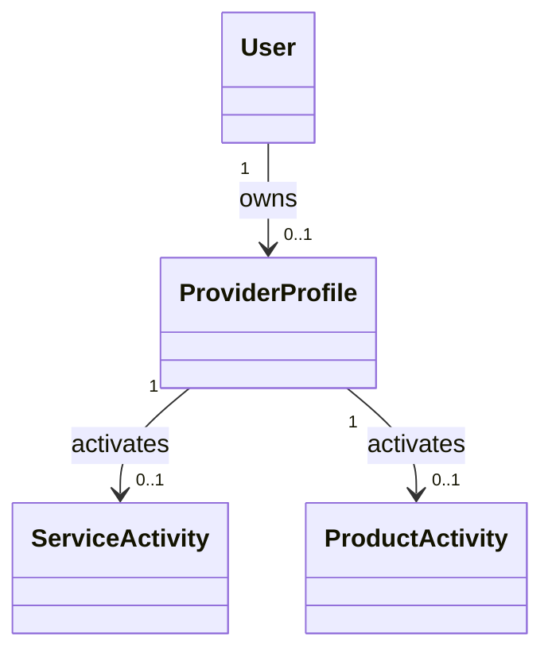

# Provider Activity Model

> **الحالة:** `ANALYZED_APPROVED`
>
> **القرار المرجعي:** `BUS-Q02` — قرار الفريق 2026-08-12.

## 1. القرار

يمتلك المستخدم `Provider Profile` واحدًا مرتبطًا بحساب `User` نفسه. داخل هذا الملف يمكن تفعيل أحد النشاطين أو كليهما:

- `Service Activity`
- `Product Activity`

وبالتالي يمكن أن يكون المقدم:

- مقدم خدمات فقط.
- مقدم منتجات فقط.
- مقدم خدمات ومنتجات معًا.

لا يتطلب الجمع بين النشاطين إنشاء حساب جديد أو Provider Profile ثانٍ.

## 2. ما هو مشترك على مستوى Provider Profile

العناصر المشتركة بين النشاطين تبقى على مستوى `Provider Profile`، ومنها مفهوميًا:

- هوية المقدم المرتبطة بحساب User.
- حالة التفعيل.
- حالة Provider Verification.
- السمعة/التقييم المرتبط بالمعاملات المؤهلة.
- معلومات عامة مشتركة تحدد لاحقًا في التصميم.

> تفاصيل إجراءات التحقق نفسها ما تزال محجوبة بـ`VER-Q01`، ولا يعني هذا القرار اعتماد ID/Selfie/OCR/Face Matching.

## 3. ما هو متخصص حسب النشاط

### Service Activity

يمثل قدرة المقدم على تقديم خدمات مهنية/فنية. ويكون له ما يلزم من بيانات خاصة بالخدمات مثل التصنيفات ومناطق الخدمة عند اعتمادها.

### Product Activity

يمثل قدرة المقدم على تقديم منتجات الأسر المنتجة/المشاريع المنزلية. ويكون له ما يلزم من بيانات خاصة بالمنتجات وطرق الاستلام/التجهيز والعربون عند اعتماد تفاصيلها.

لا يفرض هذا القرار أن تكون جميع حقول الخدمة والمنتج متطابقة.

## 4. العلاقة بالطلبات والمعاملات

كل طلب/معاملة تحدد نوع النشاط الذي تنتمي إليه:

- طلب خدمة يوجّه إلى مقدمي الخدمة المؤهلين.
- طلب منتج يوجّه إلى مقدمي المنتج المؤهلين.

إذا كان Provider Profile مفعّلًا للنشاطين، يستطيع الحساب التعامل مع كلا النوعين من بوابة المقدم نفسها، مع إبقاء مسارات العمل والحقول المتخصصة منفصلة عند الحاجة.

## 5. النموذج المفاهيمي

هذا رسم مفاهيمي وليس ERD نهائيًا. شكل الجداول النهائي يعتمد على اكتمال SRS ومتطلبات البيانات.

## 6. قواعد معتمدة

- `PROV-BR-01`: لكل مستخدم Provider Profile واحد كحد أقصى داخل الحساب نفسه.
- `PROV-BR-02`: يمكن تفعيل Service Activity أو Product Activity أو كليهما.
- `PROV-BR-03`: تفعيل نشاط ثانٍ لا ينشئ حسابًا أو Provider Profile جديدًا.
- `PROV-BR-04`: الهوية وحالة التحقق مشتركتان على مستوى Provider Profile.
- `PROV-BR-05`: بيانات ومتطلبات ومسارات الخدمة والمنتج يمكن أن تختلف حسب طبيعة النشاط.
- `PROV-BR-06`: أهلية رؤية طلب أو الاستجابة له تتطلب أن يكون النشاط المناسب مفعّلًا، إضافة إلى بقية شروط الأهلية المعتمدة لاحقًا مثل الموقع والتحقق.
