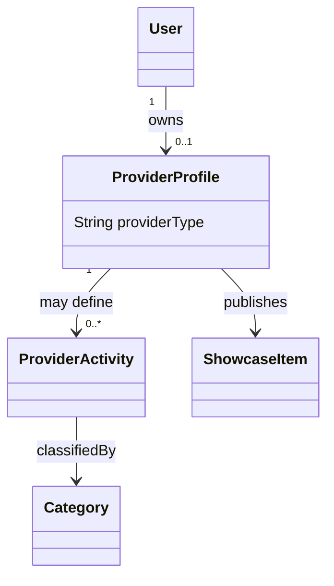

# نموذج نشاط المقدم — Provider Activity Model

> **الحالة:** `ANALYZED_APPROVED / PARTIAL — SYNCHRONIZED 2026-09-11`
>
> **أساس القرارات:** DEC-030/034/035/041/043/064/074. القرار السابق DEC-029 استُبدل جزئيًا بـDEC-074.

## 1. القرار الأساسي

يمكن لـ`User` امتلاك `Provider Profile` واحد كحد أقصى. في MVP يعمل هذا الملف تحت **نوع مقدم واحد فقط**:

- `SERVICE`
- أو `PRODUCT`

ولا يمكن تفعيل النوعين معًا على Provider Profile نفسه وفق DEC-074.

يبقى الحساب نفسه قادرًا على استخدام Beneficiary capabilities وفق نموذج الحساب الواحد.

## 2. البيانات المشتركة على مستوى Provider Profile

تكون المفاهيم التالية مشتركة على مستوى `Provider Profile`:

- الارتباط بهوية `User`؛
- نوع المقدم `providerType = SERVICE | PRODUCT`؛
- حالة `Provider Profile`؛
- حالة `Provider Verification`؛
- حالة/فترة `Subscription`؛
- مؤشرات السمعة المشتقة من `Transactions` المكتملة والمؤهلة؛
- معلومات الملف العامة المشتركة.

`Provider Verification` متطلب معتمد. أما أنواع وثائق الهوية المقبولة بدقة وفترات الاحتفاظ فتبقى تفاصيل سياسة مفتوحة ولا تغير هذا النموذج.

## 3. Provider Activities / Categories — Partial

قرار DEC-074 يحسم **نوع المقدم العام** فقط، ولا يحسم عدد الأنشطة/التصنيفات داخل النوع المختار.

أمثلة ممكنة تحتاج حسمًا لاحقًا:
- Service Provider قد يقدم كهرباء فقط، أو كهرباء + تكييف إذا سمح النموذج بأكثر من Activity/Category.
- Product Provider قد يعرض فئة منتجات واحدة أو أكثر إذا سمح النموذج بذلك.

لذلك يبقى `ProviderActivity` حاليًا Concept تحليليًا مرشحًا لتمثيل النشاط/التصنيف داخل نوع المقدم، لكن الـcardinality النهائية وطريقة التطبيع الفيزيائي لم تعتمد بعد.

**Open item:** `PROV-ACT-Q01` — عدد Provider Activities/التصنيفات داخل النوع الواحد وطريقة تمثيلها النهائية.

## 4. الطلبات والأهلية — Requests and Eligibility

يحدد كل `Request` سياق النوع ذي الصلة (`SERVICE` أو `PRODUCT`) وتصنيفه.

تحدد أهلية `Provider` لعرض الطلب/الاستجابة له وفق القواعد المعتمدة حاليًا، ومنها:
- تطابق `ProviderProfile.providerType` مع `Request.requestType`؛
- تطابق التصنيف/النشاط وفق النموذج الذي سيحسم في `PROV-ACT-Q01`؛
- أهلية منطقة الخدمة/الموقع حيث تنطبق؛
- `Provider Verification`؛
- `Active Subscription` لإرسال `Provider Responses` جديدة.

## 5. حدود العربون — Deposit Boundary

لا توجد دورة مالية للعربون داخل YADD.

- يمكن فقط لـ`Provider Response` أن تحتوي `RequiresDeposit = Yes/No`؛
- لا يتم تخزين/إدارة قيمة العربون أو نسبته أو حالة الدفع أو `Refund` أو `Escrow` كجزء من نموذج معاملة `Beneficiary↔Provider`؛
- تتم أي عملية دفع/تسوية خارج YADD.

## 6. Portfolio / Catalog

- إذا كان `providerType = SERVICE` يستخدم الملف مفهوم `Portfolio`.
- إذا كان `providerType = PRODUCT` يستخدم الملف مفهوم `Product Catalog`.
- يمكن تمثيل الاثنين تقنيًا عبر النموذج المفاهيمي الموحد `SHOWCASE_ITEM` مع تقييد العرض وفق نوع Provider Profile.
- قد تتضمن نسخة العرض علامة مائية مرتبطة بـYADD، بينما يبقى الأصل غير عام وفق النموذج المعتمد.

## 7. النموذج المفاهيمي الحالي

> `0..*` هنا لا يعتمد عدد الأنشطة النهائي؛ هو تمثيل مؤقت يسمح بوجود Draft Provider Profile وبقاء `PROV-ACT-Q01` مفتوحًا. لا يُحوَّل إلى Constraint نهائي قبل حسم السؤال.

## 8. القواعد المعتمدة

- `PROV-BR-01`: يمكن لكل `User` امتلاك `Provider Profile` واحد كحد أقصى.
- `PROV-BR-02`: في MVP يكون `Provider Profile` من نوع واحد فقط: `SERVICE` أو `PRODUCT` — DEC-074.
- `PROV-BR-03`: لا يمكن تفعيل Service وProduct معًا على Provider Profile نفسه في MVP.
- `PROV-BR-04`: الهوية و`Verification` مشتركتان على مستوى `Provider Profile`.
- `PROV-BR-05`: تتطلب أهلية Request/Response تطابق نوع المقدم مع نوع الطلب إضافة إلى بقية شروط الأهلية.
- `PROV-BR-06`: يدعم Provider Profile الـPortfolio أو Product Catalog وفق نوعه باستخدام مفهوم `ShowcaseItem` المعتمد.

## 9. نقطة مفتوحة لا يجوز اختلاقها

`PROV-ACT-Q01`: هل يسمح للمقدم بأكثر من Activity/Category داخل نوعه الواحد؟ وإذا نعم، كيف تمثل العلاقة بين ProviderProfile وProviderActivity وCategory؟

حتى حسمها:
- لا نفترض Activity واحدة فقط.
- لا نفترض Activities غير محدودة.
- لا نحذف `ProviderActivity` من الـERD/Class لمجرد اعتماد DEC-074.

## 10. إرشادات المخططات — Diagram Guidance

في `Main Use Case Diagram` استخدم Actor عامًا باسم `Provider`، وأظهر تخصص `Service Provider` / `Product Provider` فقط عندما يضيف ذلك وضوحًا. DEC-074 يعني أن Provider Profile الواحد يمثل أحد التخصصين فقط في MVP.

في مخططات `ERD/Class`، لا تمثل `Service Provider` و`Product Provider` كحسابات User منفصلة.