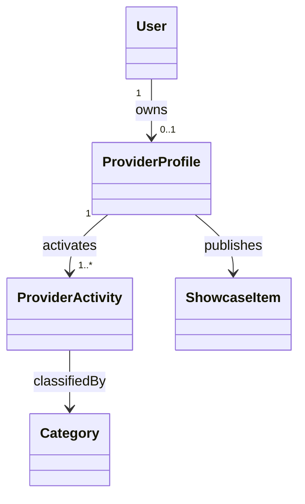

# Provider Activity Model

> **Status:** `ANALYZED_APPROVED — SYNCHRONIZED 2026-09-04`
>
> **Decision basis:** DEC-029/030/034/035/041/043/064.

## 1. Core Decision

A User may own one `Provider Profile`. Inside that profile the Provider may activate:

- `Service Activity`
- `Product Activity`
- or both.

Activating both does not create a second User account or a second Provider Profile.

## 2. Shared Provider-Profile Data

The following concepts are shared at Provider Profile level:

- User identity linkage;
- Provider Profile status;
- Provider Verification status;
- Subscription status/period;
- reputation indicators derived from eligible completed Transactions;
- common profile information.

Provider Verification is an approved requirement. Exact accepted identity-document types and retention periods remain open policy details and do not alter this model.

## 3. Activity-Specific Concepts

### Service Activity

Represents professional/technical service capability and may be associated with:
- categories;
- Provider Service Areas;
- Service Portfolio items.

### Product Activity

Represents products from home-based/small household projects and may be associated with:
- categories;
- preparation/fulfillment information;
- Product Catalog items.

Both activity types use the same Core Transaction model after the Provider is selected/confirmed.

## 4. Requests and Eligibility

Each Request identifies the relevant activity context (`Service` or `Product`).

A Provider is eligible to view/respond according to the currently approved rules, including:
- matching activity/category;
- service-area/location eligibility where applicable;
- Provider Verification;
- Active Subscription for submitting new Provider Responses.

## 5. Deposit Boundary

There is no financial deposit lifecycle inside YADD.

- only a `Provider Response` may contain `RequiresDeposit = Yes/No`;
- no deposit amount, percentage, payment status, refund or escrow is stored/managed as part of the Beneficiary↔Provider transaction model;
- any payment/settlement occurs outside YADD.

Therefore `RequiresDeposit` is **not** a separate Provider Activity, Use Case, Payment entity or Transaction state.

## 6. Portfolio / Catalog

- Service Provider uses a Portfolio concept.
- Product Provider uses a Product Catalog concept.
- both may be represented technically through the unified conceptual `SHOWCASE_ITEM` model.
- display media may include YADD-linked watermarking; original media remains non-public according to the approved model.

## 7. Conceptual Model

`ProviderActivity.activityType` conceptually distinguishes `SERVICE` and `PRODUCT`. The physical database representation is a Chapter Four design decision.

## 8. Approved Rules

- `PROV-BR-01`: one Provider Profile at most per User.
- `PROV-BR-02`: Service Activity, Product Activity, or both are allowed.
- `PROV-BR-03`: activating another activity does not create another account/profile.
- `PROV-BR-04`: identity and Verification are shared at Provider Profile level.
- `PROV-BR-05`: Service/Product data may differ where domain needs differ.
- `PROV-BR-06`: Request/response eligibility requires matching activity plus other approved eligibility rules.
- `PROV-BR-07`: Portfolio/Catalog are supported within Provider Profile using the approved Showcase concept.

## 9. Diagram Guidance

For the Main Use Case Diagram, use a general `Provider` actor and show `Service Provider` / `Product Provider` specialization only when it adds clarity. Do not duplicate every Provider use case for both subtypes when the behavior is inherited.

For ERD/Class diagrams, do not model Service Provider and Product Provider as separate User accounts.