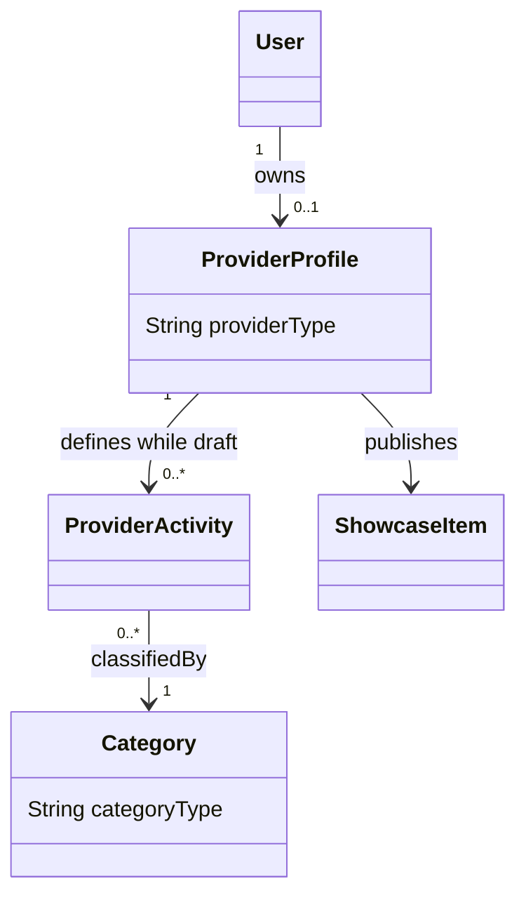

# نموذج نشاط المقدم — Provider Activity Model

> **الحالة:** `ANALYZED_APPROVED — SYNCHRONIZED 2026-09-11`
>
> **أساس القرارات:** DEC-030/034/035/041/043/064/074/076. القرار السابق DEC-029 استُبدل جزئيًا بـDEC-074.

## 1. القرار الأساسي

يمكن لـ`User` امتلاك `Provider Profile` واحد كحد أقصى. في MVP يعمل هذا الملف تحت **نوع مقدم واحد فقط**:

- `SERVICE`
- أو `PRODUCT`

ولا يمكن تفعيل النوعين معًا على Provider Profile نفسه وفق DEC-074.

داخل النوع المختار، يمكن للمقدم اختيار **تصنيف واحد أو أكثر** وفق DEC-076، بشرط أن تنتمي جميع التصنيفات إلى نوع Provider Profile نفسه.

يبقى الحساب نفسه قادرًا على استخدام Beneficiary capabilities وفق نموذج الحساب الواحد.

## 2. البيانات المشتركة على مستوى Provider Profile

تكون المفاهيم التالية مشتركة على مستوى `Provider Profile`:

- الارتباط بهوية `User`؛
- نوع المقدم `providerType = SERVICE | PRODUCT`؛
- حالة `Provider Profile`؛
- حالة `Provider Verification`؛
- حالة/فترة `Subscription`؛
- مؤشرات السمعة المشتقة من `Transactions` المكتملة والمؤهلة؛
- معلومات الملف العامة المشتركة.

`Provider Verification` متطلب معتمد. أما أنواع وثائق الهوية المقبولة بدقة وفترات الاحتفاظ فتبقى تفاصيل سياسة مفتوحة ولا تغير هذا النموذج.

## 3. Provider Activities / Categories

يمثل `ProviderActivity` ارتباط Provider Profile بتصنيف (`Category`) داخل نوعه المختار.

أمثلة:
- Service Provider يمكن أن يختار كهرباء + تكييف + صيانة منزلية.
- Product Provider يمكن أن يختار حلويات + مخبوزات + هدايا يدوية.

القواعد:
- يمكن لـDraft Provider Profile أن يحتوي مؤقتًا `0..*` Provider Activities أثناء الإعداد.
- قبل أن يصبح Provider Profile مؤهلًا لوظائف التقديم يجب أن يحتوي **Provider Activity واحدة على الأقل**.
- لا يجوز ربط Provider Activity بتصنيف من نوع مختلف عن `ProviderProfile.providerType`.
- لا يحدد التحليل الحالي حدًا أقصى رقميًا لعدد التصنيفات؛ عدم وجود حد رقمي لا يعني بالضرورة أن التنفيذ النهائي بلا أي قيود تشغيلية، وإنما لا يوجد حد معتمد حاليًا.

## 4. الطلبات والأهلية — Requests and Eligibility

يحدد كل `Request` سياق النوع ذي الصلة (`SERVICE` أو `PRODUCT`) وتصنيفه.

تحدد أهلية `Provider` لعرض الطلب/الاستجابة له وفق القواعد المعتمدة حاليًا، ومنها:
- تطابق `ProviderProfile.providerType` مع `Request.requestType`؛
- وجود `ProviderActivity` مرتبط بتصنيف الطلب؛
- أهلية منطقة الخدمة/الموقع حيث تنطبق؛
- `Provider Verification`؛
- `Active Subscription` لإرسال `Provider Responses` جديدة.

## 5. حدود العربون — Deposit Boundary

لا توجد دورة مالية للعربون داخل YADD.

- يمكن فقط لـ`Provider Response` أن تحتوي `RequiresDeposit = Yes/No`؛
- لا يتم تخزين/إدارة قيمة العربون أو نسبته أو حالة الدفع أو `Refund` أو `Escrow` كجزء من نموذج معاملة `Beneficiary↔Provider`؛
- تتم أي عملية دفع/تسوية خارج YADD.

## 6. Portfolio / Catalog

- إذا كان `providerType = SERVICE` يستخدم الملف مفهوم `Portfolio`.
- إذا كان `providerType = PRODUCT` يستخدم الملف مفهوم `Product Catalog`.
- يمكن تمثيل الاثنين تقنيًا عبر النموذج المفاهيمي الموحد `SHOWCASE_ITEM` مع تقييد العرض وفق نوع Provider Profile.
- قد تتضمن نسخة العرض علامة مائية مرتبطة بـYADD، بينما يبقى الأصل غير عام وفق النموذج المعتمد.

## 7. النموذج المفاهيمي الحالي

> ملاحظة Cardinality: `0..*` على مستوى النموذج العام يسمح بحالة Draft. القيد التشغيلي هو أن Provider Profile لا يصبح مؤهلًا لوظائف التقديم حتى يكون لديه `1..*` Provider Activities صالحة من النوع نفسه.

## 8. القواعد المعتمدة

- `PROV-BR-01`: يمكن لكل `User` امتلاك `Provider Profile` واحد كحد أقصى.
- `PROV-BR-02`: في MVP يكون `Provider Profile` من نوع واحد فقط: `SERVICE` أو `PRODUCT` — DEC-074.
- `PROV-BR-03`: لا يمكن تفعيل Service وProduct معًا على Provider Profile نفسه في MVP.
- `PROV-BR-04`: الهوية و`Verification` مشتركتان على مستوى `Provider Profile`.
- `PROV-BR-05`: يمكن للمقدم اختيار تصنيف واحد أو أكثر داخل نوعه فقط — DEC-076.
- `PROV-BR-06`: Draft Provider Profile يمكن أن يحتوي مؤقتًا صفر Provider Activities؛ التفعيل لوظائف التقديم يتطلب Activity واحدة على الأقل — DEC-076.
- `PROV-BR-07`: يجب أن يتوافق `Category.categoryType` مع `ProviderProfile.providerType` لكل Provider Activity.
- `PROV-BR-08`: تتطلب أهلية Request/Response تطابق نوع المقدم وتصنيف الطلب إضافة إلى بقية شروط الأهلية.
- `PROV-BR-09`: يدعم Provider Profile الـPortfolio أو Product Catalog وفق نوعه باستخدام مفهوم `ShowcaseItem` المعتمد.

## 9. نقاط تصميم تؤجل إلى Chapter Four

تم إغلاق `PROV-ACT-Q01` على المستوى التحليلي بقرار DEC-076. وما يزال التنفيذ الفيزيائي يحتاج تحديدًا لآليات مثل:
- منع duplicate لنفس `(ProviderProfile, Category)`؛
- كيفية فرض توافق `providerType/categoryType` في قاعدة البيانات أو طبقة الأعمال؛
- هل يلزم حد تشغيلي أقصى للتصنيفات بعد اختبار الاستخدام؛
- أسماء الجداول والـPK/FK والـindexes النهائية.

هذه Design Details وليست إعادة فتح للقرار التحليلي.

## 10. إرشادات المخططات — Diagram Guidance

في `Main Use Case Diagram` استخدم Actor عامًا باسم `Provider`، وأظهر تخصص `Service Provider` / `Product Provider` فقط عندما يضيف ذلك وضوحًا. DEC-074 يعني أن Provider Profile الواحد يمثل أحد التخصصين فقط في MVP.

في مخططات `ERD/Class`، لا تمثل `Service Provider` و`Product Provider` كحسابات User منفصلة، ومثّل تعدد التصنيفات عبر ProviderActivity/Category أو تمثيل فيزيائي مكافئ يحافظ على DEC-076.