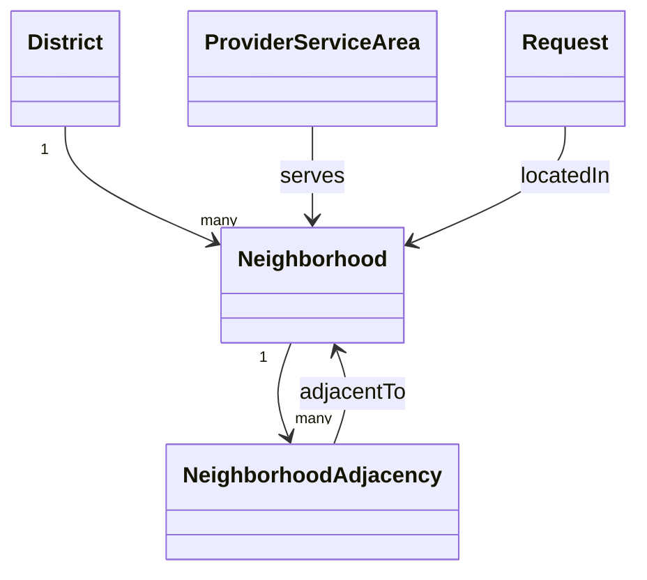

# Location & Neighborhood Model

> **الحالة:** `ANALYZED_APPROVED`
>
> **القرار المرجعي:** `LOC-Q01` — قرار الفريق 2026-08-12، مع تحقق خارجي من توفر تقنيات الخرائط وحدود الاعتماد عليها في اليمن.

## 1. القرار الأساسي

يعتمد YADD في MVP على **نموذج إداري مُدار داخل النظام** لتحديد الموقع والمطابقة الجغرافية، وليس على مسافة GPS كقاعدة أساسية لتوزيع الطلبات.

النموذج العام:

`أمانة العاصمة → مديرية → حي`

ويكون للحي علاقات جوار معرفة داخل YADD وقابلة للإدارة والتعديل.

## 2. موقع طلب المستفيد

عند إنشاء طلب خدمة أو منتج يحدد المستفيد:

- المديرية.
- الحي.

لا يطلب النظام نشر عنوان المنزل الدقيق أو إحداثياته للعامة.

بعد اختيار مقدم وفتح `Transaction Chat` يمكن للمستفيد — عند الحاجة وبإرادته — مشاركة موقع أدق أو Pin/إحداثيات داخل سياق المعاملة فقط.

## 3. نطاق خدمة المقدم

يحدد المقدم المناطق التي يستطيع خدمتها باستخدام المديريات و/أو الأحياء المعتمدة في YADD.

لا يفترض النظام أن مقدم الخدمة يخدم فقط الموقع الحالي لهاتفه أو نقطة GPS ثابتة، لأن طبيعة مقدم الخدمة قد تتطلب التنقل بين عدة مناطق.

## 4. التوزيع الجغرافي للطلب

عند نشر الطلب:

1. يوجه أولًا إلى المقدمين المؤهلين الذين تشمل مناطق خدمتهم **حي الطلب نفسه**.
2. إذا لم توجد استجابات كافية، يستطيع النظام توسيع النطاق إلى **الأحياء المجاورة** المعرفة داخل YADD.
3. التوسع لا يعتمد في MVP على دائرة نصف قطر GPS محسوبة آليًا.

> قيمة «الاستجابات الكافية» والزمن قبل التوسع لم تعتمدا بعد؛ عند الحاجة يمكن ضبطهما كإعداد تشغيلي لاحقًا بدل تثبيتهما الآن كمتطلب نهائي.

## 5. نموذج الأحياء المجاورة

يعرف النظام علاقة جوار بين الأحياء، مثل:

`Neighborhood A <-> Neighborhood B`

ويجب أن تكون العلاقة قابلة للإدارة من لوحة الإدارة/بيانات النظام.

### لماذا لا نعتمد GPS Radius كأساس في MVP؟

- أسماء وحدود الأحياء المستخدمة محليًا قد لا تكون متجانسة بما يكفي للاعتماد الكامل على مزود خرائط خارجي.
- المسافة الخطية لا تعني دائمًا سهولة الوصول الفعلية بين منطقتين.
- قائمة الجوار أسهل في المراجعة والتصحيح محليًا.
- تقلل الاعتماد التشغيلي على Geocoding/Maps API خارجي في وظيفة أساسية للنظام.
- تناسب نطاق المشروع المحدود بأمانة العاصمة ويمكن إدارتها كبيانات مرجعية.

## 6. دور الخرائط وGPS

وجود Google Maps/OpenStreetMap أو GPS يظل مفيدًا، لكنه **ميزة مساعدة** وليس محرك الأهلية الأساسي في MVP.

يمكن استخدامه لاحقًا في:

- مشاركة موقع دقيق داخل المعاملة بعد اختيار المقدم.
- عرض Pin على خريطة.
- مساعدة المستخدم في فهم موقعه.
- تحسين المطابقة في إصدار لاحق إذا أثبتت البيانات المحلية جدواها.

لا يعتمد هذا القرار مزود خرائط نهائيًا؛ اختيار Google Maps أو OpenStreetMap أو غيرهما قرار تقني منفصل.

## 7. الخصوصية

- المديرية والحي: يمكن استخدامهما في الطلب والمطابقة.
- العنوان الدقيق/الإحداثيات: لا تظهر في الطلب العام.
- الموقع الدقيق يشارك فقط بعد اختيار مقدم وعند حاجة المعاملة.
- لا يحتاج مقدم الخدمة إلى رؤية الموقع الدقيق للمستفيد لمجرد تصفح قائمة الطلبات.

## 8. التحقق من بيانات صنعاء

المركز الوطني للمعلومات يعرض بنية إدارية لأمانة العاصمة تشمل مديريات وأحياء، ما يدعم صلاحية نموذج `مديرية + حي` كمفهوم. لكن بعض البيانات المنشورة تستند إلى تعداد 2004 وتوجد صفحات مختلفة في عدد المديريات، لذلك:

- **القرار المعتمد:** استخدام بنية مديرية/حي وقائمة جوار مُدارة.
- **معلومة تحتاج تحققًا قبل بيانات الإنتاج:** القائمة الحالية النهائية للمديريات والأحياء وعلاقات الجوار بينها.
- أمثلة مثل «الجراف مجاور للتلفزيون/الحصبة» لا تعتمد كبيانات نهائية إلا بعد التحقق المحلي.

## 9. النموذج المفاهيمي

هذا نموذج تحليلي وليس ERD نهائيًا.

## 10. قواعد معتمدة

- `LOC-BR-01`: يحدد المستفيد المديرية والحي عند إنشاء الطلب.
- `LOC-BR-02`: لا يعرض العنوان الدقيق أو GPS للمستفيد في الطلب العام.
- `LOC-BR-03`: يمكن مشاركة الموقع الدقيق داخل Transaction Chat بعد اختيار مقدم وعند الحاجة.
- `LOC-BR-04`: يحدد المقدم المديريات/الأحياء التي يستطيع خدمتها.
- `LOC-BR-05`: يوجه الطلب أولًا إلى المقدمين الذين يخدمون حي الطلب نفسه.
- `LOC-BR-06`: يمكن توسيع الطلب إلى الأحياء المجاورة إذا لم تتحقق استجابة كافية.
- `LOC-BR-07`: تحدد الأحياء المجاورة بقائمة علاقات جوار مُدارة داخل YADD في MVP، وليس بحساب Radius GPS كأساس.
- `LOC-BR-08`: اختيار مزود الخرائط/GPS لا يعد جزءًا من قرار نموذج المطابقة الجغرافية نفسه.

## 11. مصادر البحث الخارجي

راجع `docs/02-research/02-source-register.md`: `EXT-MAP-01..03`, `YEM-GEO-01`.
