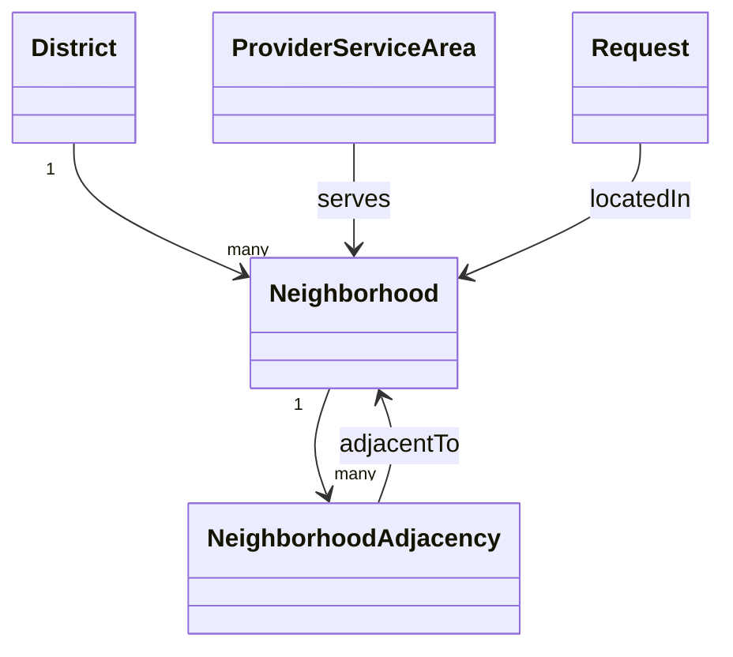

# Location & Neighborhood Model

> **الحالة:** `ANALYZED_APPROVED`
>
> **القرارات المرجعية:** `DEC-031..033/045/046` + `LOC-Q01` + `LOC-OPS-Q01` — مع تحقق خارجي من توفر تقنيات الخرائط وحدود الاعتماد عليها في اليمن.

## 1. القرار الأساسي

يعتمد YADD في MVP على **نموذج إداري مُدار داخل النظام** لتحديد الموقع والمطابقة الجغرافية، وليس على مسافة GPS كقاعدة أساسية لتوزيع الطلبات.

النموذج العام:

`أمانة العاصمة → مديرية → حي`

ويكون للحي علاقات جوار معرفة داخل YADD وقابلة للإدارة والتعديل.

## 2. موقع طلب المستفيد

عند إنشاء طلب خدمة أو منتج يحدد المستفيد:

- المديرية.
- الحي.

لا يطلب النظام نشر عنوان المنزل الدقيق أو إحداثياته للعامة.

يمكن للمستفيد — عند الحاجة وبإرادته — مشاركة موقع أدق أو Pin/إحداثيات داخل **التواصل الخاص** مع مقدم محدد، سواء كان التواصل استفسارًا قبل بدء المعاملة أو جزءًا من معاملة جارية. مشاركة الموقع الدقيق ليست شرطًا لبدء المحادثة أو المعاملة، ولا تجعله ظاهرًا لبقية المقدمين أو للعامة.

## 3. نطاق خدمة المقدم

يحدد المقدم المناطق التي يستطيع خدمتها باستخدام المديريات و/أو الأحياء المعتمدة في YADD.

لا يفترض النظام أن مقدم الخدمة يخدم فقط الموقع الحالي لهاتفه أو نقطة GPS ثابتة، لأن طبيعة مقدم الخدمة قد تتطلب التنقل بين عدة مناطق.

## 4. التوزيع الجغرافي للطلب

عند نشر الطلب:

1. يوجه أولًا إلى المقدمين المؤهلين الذين تشمل مناطق خدمتهم **حي الطلب نفسه**.
2. إذا مرت مدة تشغيلية محددة دون وصول استجابة مناسبة/استجابات من المقدمين في النطاق الأول، **لا يوسع YADD الطلب تلقائيًا**.
3. يرسل النظام إشعارًا أو يعرض Prompt لصاحب الطلب يسأله إن كان يريد توسيع النطاق إلى الأحياء المجاورة المعرفة داخل YADD.
4. لا يتم التوسع إلا بعد موافقة صاحب الطلب.
5. إذا رفض أو تجاهل اقتراح التوسع، يبقى النطاق على الحي الحالي إلى أن يقرر التوسيع لاحقًا أو يصبح الطلب `Expired` وفق سياسة عدم النشاط.
6. التوسع لا يعتمد في MVP على دائرة نصف قطر GPS محسوبة آليًا.

> **المدة الرقمية الدقيقة قبل إظهار اقتراح التوسع لم تعتمد بعد**، وتبقى إعدادًا تشغيليًا تحت `LOC-OPS-TIME-Q01` بدل تثبيتها دون اختبار.

## 5. صياغة تنبيه التوسع المقترحة للواجهة

صياغة مناسبة للـMVP:

> **لم تصل استجابات كافية لطلبك ضمن الحي الحالي. هل ترغب في توسيع نطاق الطلب إلى الأحياء المجاورة؟**
>
> قد يؤدي توسيع النطاق إلى اختلاف السعر أو إضافة تكاليف انتقال/توصيل بحسب نوع الطلب والمقدم. أي تكلفة إضافية لا تفرضها YADD، وتخضع للاتفاق بينك وبين مقدم الخدمة أو المنتج.

أزرار واجهة مقترحة:

- `توسيع نطاق الطلب`
- `الاستمرار في الحي الحالي`

هذه الصياغة واجهة مقترحة ويمكن تحسين نصها في مرحلة UX، أما **وجوب موافقة صاحب الطلب قبل التوسع** فهو قرار معتمد.

## 6. نموذج الأحياء المجاورة

يعرف النظام علاقة جوار بين الأحياء، مثل:

`Neighborhood A <-> Neighborhood B`

ويجب أن تكون العلاقة قابلة للإدارة من لوحة الإدارة/بيانات النظام.

### لماذا لا نعتمد GPS Radius كأساس في MVP؟

- أسماء وحدود الأحياء المستخدمة محليًا قد لا تكون متجانسة بما يكفي للاعتماد الكامل على مزود خرائط خارجي.
- المسافة الخطية لا تعني دائمًا سهولة الوصول الفعلية بين منطقتين.
- قائمة الجوار أسهل في المراجعة والتصحيح محليًا.
- تقلل الاعتماد التشغيلي على Geocoding/Maps API خارجي في وظيفة أساسية للنظام.
- تناسب نطاق المشروع المحدود بأمانة العاصمة ويمكن إدارتها كبيانات مرجعية.

## 7. دور الخرائط وGPS

وجود Google Maps/OpenStreetMap أو GPS يظل مفيدًا، لكنه **ميزة مساعدة** وليس محرك الأهلية الأساسي في MVP.

يمكن استخدامه لاحقًا في:

- مشاركة موقع دقيق داخل التواصل الخاص مع مقدم محدد عند الحاجة.
- عرض Pin على خريطة.
- مساعدة المستخدم في فهم موقعه.
- تحسين المطابقة في إصدار لاحق إذا أثبتت البيانات المحلية جدواها.

لا يعتمد هذا القرار مزود خرائط نهائيًا؛ اختيار Google Maps أو OpenStreetMap أو غيرهما قرار تقني منفصل.

## 8. الخصوصية

- المديرية والحي: يمكن استخدامهما في الطلب والمطابقة.
- العنوان الدقيق/الإحداثيات: لا تظهر في الطلب العام.
- الموقع الدقيق يشارك اختياريًا فقط داخل التواصل الخاص مع مقدم محدد وعند الحاجة.
- لا يحتاج مقدم الخدمة إلى رؤية الموقع الدقيق للمستفيد لمجرد تصفح قائمة الطلبات.

## 9. التحقق من بيانات صنعاء

المركز الوطني للمعلومات يعرض بنية إدارية لأمانة العاصمة تشمل مديريات وأحياء، ما يدعم صلاحية نموذج `مديرية + حي` كمفهوم. لكن بعض البيانات المنشورة تستند إلى تعداد 2004 وتوجد صفحات مختلفة في عدد المديريات، لذلك:

- **القرار المعتمد:** استخدام بنية مديرية/حي وقائمة جوار مُدارة.
- **معلومة تحتاج تحققًا قبل بيانات الإنتاج:** القائمة الحالية النهائية للمديريات والأحياء وعلاقات الجوار بينها.
- أمثلة مثل «الجراف مجاور للتلفزيون/الحصبة» لا تعتمد كبيانات نهائية إلا بعد التحقق المحلي.

## 10. النموذج المفاهيمي

هذا نموذج تحليلي وليس ERD نهائيًا.

## 11. قواعد معتمدة

- `LOC-BR-01`: يحدد المستفيد المديرية والحي عند إنشاء الطلب.
- `LOC-BR-02`: لا يعرض العنوان الدقيق أو GPS للمستفيد في الطلب العام.
- `LOC-BR-03`: يمكن مشاركة الموقع الدقيق اختياريًا داخل التواصل الخاص مع مقدم محدد وعند الحاجة؛ لا يشترط أن تكون Transaction قد بدأت.
- `LOC-BR-04`: يحدد المقدم المديريات/الأحياء التي يستطيع خدمتها.
- `LOC-BR-05`: يوجه الطلب أولًا إلى المقدمين الذين يخدمون حي الطلب نفسه.
- `LOC-BR-06`: بعد المدة التشغيلية المحددة وغياب الاستجابة الكافية، يقترح النظام التوسع ولا ينفذه تلقائيًا.
- `LOC-BR-07`: لا يتوسع النطاق إلى الأحياء المجاورة إلا بعد موافقة صريحة من صاحب الطلب.
- `LOC-BR-08`: يجب تنبيه صاحب الطلب قبل التوسع إلى احتمال اختلاف السعر أو وجود تكاليف انتقال/توصيل يحددها الاتفاق مع المقدم، لا YADD.
- `LOC-BR-09`: تحدد الأحياء المجاورة بقائمة علاقات جوار مُدارة داخل YADD في MVP، وليس بحساب Radius GPS كأساس.
- `LOC-BR-10`: اختيار مزود الخرائط/GPS لا يعد جزءًا من قرار نموذج المطابقة الجغرافية نفسه.

## 12. سؤال تشغيلي باقٍ

- `LOC-OPS-TIME-Q01`: ما المدة الرقمية التي ينتظرها النظام قبل عرض اقتراح توسيع النطاق؟

## 13. مصادر البحث الخارجي

راجع `docs/02-research/02-source-register.md`: `EXT-MAP-01..03`, `YEM-GEO-01`.
