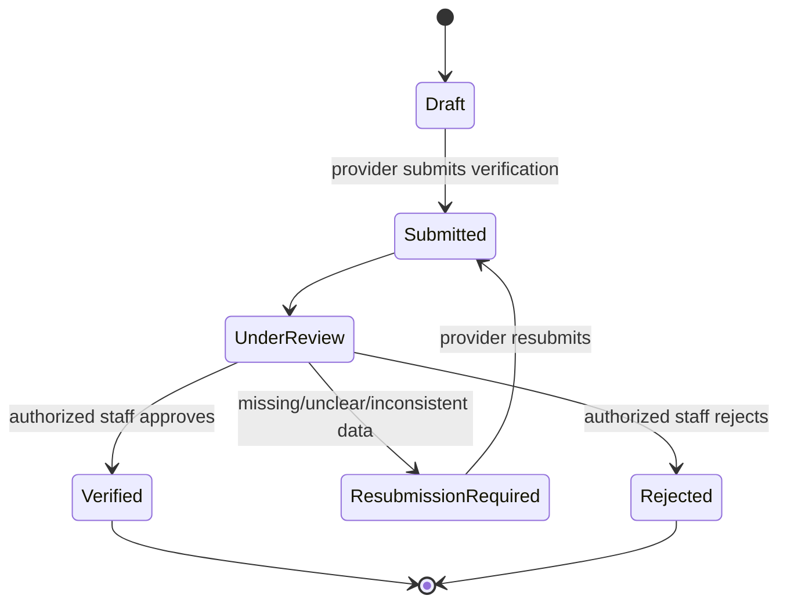

# Provider Verification Model

> **الحالة:** `ANALYZED_APPROVED — SYNCHRONIZED 2026-09-18 THROUGH DEC-085`
>
> **القرارات المرجعية:** DEC-035/036/037..040/085.

## 1. الهدف

يفرق YADD بين `Account Verified` و`Identity Verified`. `Service Provider` فقط يحتاج Identity Verification حكومية قبل وظائف التقديم بسبب حساسية بعض الخدمات التي قد تتطلب دخول المنازل أو المنشآت. `Product Provider` لا يطلب منه Government ID في MVP، لكنه يحتاج Account Verified بالهاتف وبقية شروط Provider Profile والاشتراك.

التحقق من الهوية لا يمنع صاحب الحساب من استخدام YADD كمستفيد أثناء انتظار المراجعة.

## 2. متطلبات التحقق الأساسية

عند طلب Identity Verification لـService Provider يجب تقديم:

- رقم هاتف موثق وبيانات الاسم الحقيقي من User Account.
- `National ID` أو `Passport`.
- صورة واضحة للوثيقة.
- صورة شخصية للمستخدم مع الوثيقة.

`Product Provider` لا يرفع Government ID في MVP، ولا يجوز إظهار Badge باسم `Identity Verified` له لمجرد توثيق الهاتف.

## 3. المراجعة والتفعيل

يمر طلب التحقق بالحالات المفاهيمية التالية:

- لا يتم تفعيل Provider Profile تلقائيًا بمجرد رفع الوثائق.
- القرار النهائي بالتفعيل أو طلب إعادة التقديم أو الرفض يتخذه موظف YADD مخول.
- يجب أن يستطيع الموظف تسجيل ملاحظة/سبب عند طلب إعادة التقديم أو الرفض.
- قبل `Verified` لا يستطيع Service Provider تنفيذ وظائف التقديم. Product Provider يتبع أهلية الحساب/الملف/الاشتراك دون هذا المسار.

## 4. دور الذكاء الاصطناعي في التحقق

يمكن للنظام تشغيل طبقة فحص آلية مساعدة قبل/أثناء المراجعة البشرية، وتشمل الوظائف المعتمدة في `AI-Q01`:

- `OCR` لاستخراج بيانات ظاهرة من وثيقة الهوية ومقارنتها ببيانات الطلب.
- فحص جودة الصورة وقابليتها للقراءة.
- Face Similarity بين صورة الوثيقة والصورة/اللقطة المخصصة للتحقق عند توفر مدخل مناسب.
- Liveness / Anti-Spoofing عند استخدام التقاط حي مخصص لهذا الغرض.
- اكتشاف مؤشرات تكرار أو إعادة استخدام وثيقة/هوية في أكثر من حساب.
- إنتاج Flags أو درجة خطورة تساعد الموظف في المراجعة.

نتيجة الذكاء الاصطناعي **استشارية** ولا تؤدي وحدها إلى تفعيل أو رفض نهائي للحساب.

## 5. الحدود القانونية والدلالية

- `Verified Provider` يعني أن YADD نفذ إجراءات التحقق المعتمدة لديه ووافق على تفعيل الملف.
- لا يعني ذلك أن YADD أثبت خلو الشخص من السوابق أو أنه صالح قانونيًا لجميع المهن.
- لا يفترض وجود وصول إلى قاعدة بيانات حكومية أو سجل جنائي ما لم توجد شراكة/صلاحية رسمية موثقة مستقبلًا.
- التراخيص المهنية الخاصة ببعض الأنشطة، إن لزم اعتمادها، تحتاج قرارًا منفصلًا حسب نوع النشاط.

## 6. حماية بيانات التحقق

صور الهوية والصور الشخصية ونتائج المطابقة تعتبر بيانات تحقق حساسة، ولذلك:

- لا تعرض للمستفيدين أو مقدمي الخدمات الآخرين.
- لا يطلع عليها إلا موظفون مخولون وفق صلاحيات محددة.
- يجب تسجيل الوصول/المراجعة الحساسة في Audit Log.
- يجب تخزينها ونقلها بطريقة آمنة ومشفرة وفق التصميم الأمني.
- لا تستخدم لتدريب نماذج AI دون أساس وموافقة وسياسة صريحة.
- مدة الاحتفاظ والحذف والمتطلبات القانونية المحلية تبقى `NEEDS_LEGAL_VERIFICATION`.

## 7. قواعد معتمدة

- `VER-BR-01`: Identity Verification الحكومية إلزامية لـService Provider فقط قبل وظائف التقديم.
- `VER-BR-02`: تقبل National ID أو Passport مع صورة الوثيقة وصورة شخصية مع الوثيقة.
- `VER-BR-03`: لا تفعّل صلاحيات المقدم تلقائيًا بعد رفع الوثائق.
- `VER-BR-04`: القرار النهائي في طلب التحقق بشري ومن موظف YADD مخول.
- `VER-BR-05`: قبل Identity Verification يمكن للحساب العمل كمستفيد، لكن Service Provider لا يمارس وظائف التقديم؛ Product Provider لا يخضع لهذا الشرط.
- `VER-BR-06`: يمكن للذكاء الاصطناعي تنفيذ فحوص مساعدة وإنتاج Flags، لكنه لا يملك قرار التفعيل/الرفض النهائي وحده.
- `VER-BR-07`: بيانات التحقق الحساسة ليست عامة وتخضع لصلاحيات وصول وسجل تدقيق.

## 8. أسئلة فرعية باقية

- `VER-RET-Q01`: ما مدة الاحتفاظ بصور الهوية والبيانات البيومترية/نتائج المطابقة؟
- `VER-LIC-Q01`: هل توجد فئات نشاط محددة تتطلب إثبات ترخيص مهني إضافي؟
