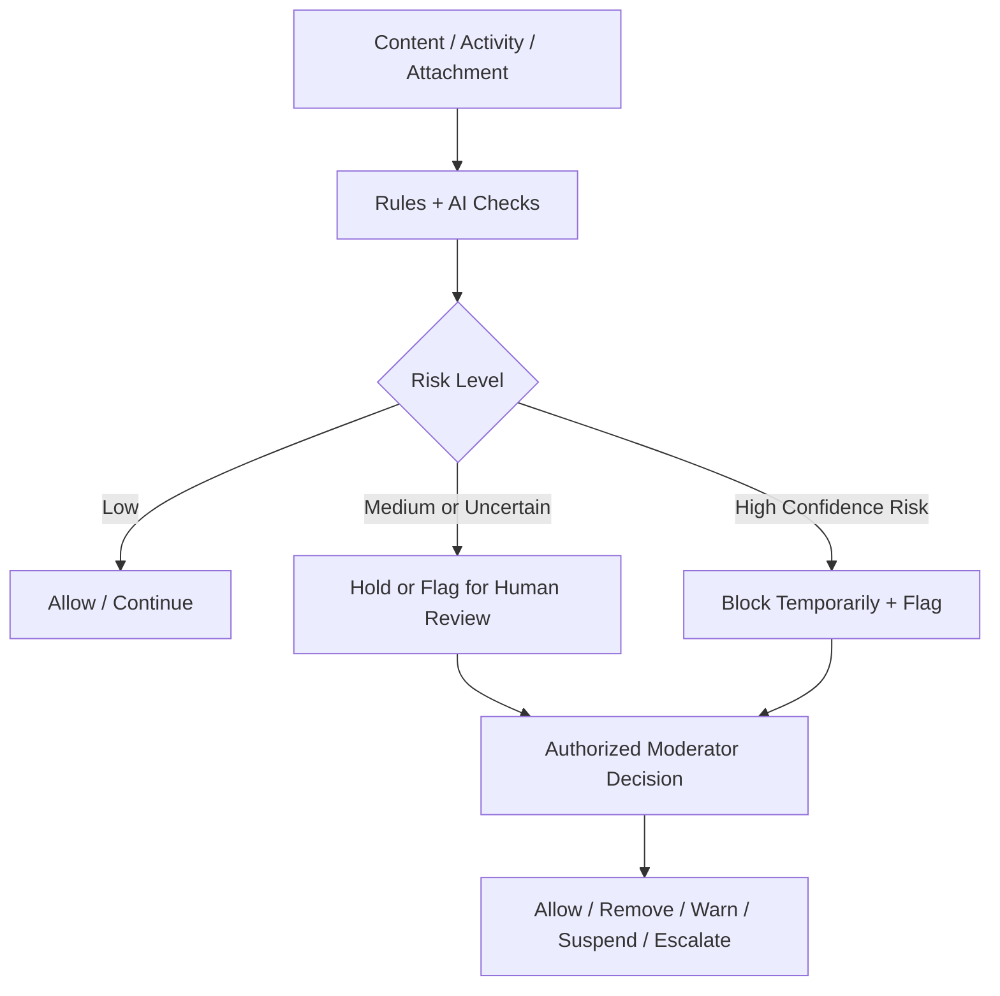

# AI Trust & Safety Model

> **الحالة:** `ANALYZED_APPROVED`
>
> **القرارات المرجعية:** `DEC-037..040/053/054` — مع تحديث تدفق التواصل 2026-08-26.

## 1. الهدف

لا يستخدم YADD الذكاء الاصطناعي كعنصر تجميلي أو Chatbot فقط. الوظائف الأساسية المعتمدة للذكاء الاصطناعي في MVP تعمل في الخلفية ضمن مجالين:

1. **Provider Verification Assistance** — دعم التحقق من هوية مقدمي الخدمات/المنتجات.
2. **Trust & Safety Moderation** — فحص النصوص والصور والأنشطة التجارية داخل المنصة لاكتشاف المحتوى أو السلوك المخالف لسياسات YADD.

## 2. مبدأ الحوكمة

الذكاء الاصطناعي لا يضع بنفسه أحكامًا دينية أو قانونية عامة، ولا يملك سلطة مستقلة للحظر النهائي أو رفض الحسابات في الحالات الحساسة.

- تحدد YADD سياسة واضحة للمحتوى والأنشطة المسموحة والممنوعة.
- يستخدم AI لاكتشاف المخاطر وتصنيفها وإنتاج Flags/درجات ثقة.
- الحالات غير الواضحة أو عالية الأثر تذهب إلى موظف/مشرف مخول لاتخاذ القرار النهائي.
- `Block` أداة حماية مباشرة بين المستخدمين، بينما `Report` وAI Flags مدخلات للمراجعة ولا تعني إدانة تلقائية.

## 3. نطاق الفحص المعتمد

### 3.1 Text Moderation

يفحص النظام عند الحاجة:

- رسائل المحادثات الخاصة المرتبطة بالاستفسار أو المعاملة.
- وصف الطلبات.
- وصف النشاط/المنتج.
- التعليقات النصية والتقييمات.
- حقول نصية أخرى خاضعة لسياسة المحتوى.

يبحث عن مؤشرات مثل:

- تهديد أو تحرش أو إساءة شديدة.
- محتوى جنسي/صريح أو استغلالي وفق سياسة YADD.
- دعوات أو وصف لأنشطة محظورة داخل المنصة.
- محاولات إساءة استخدام المنصة أو محتوى يخالف سياسة النشاط التجاري.

### 3.2 Image Moderation

يفحص النظام الصور والمرفقات مثل:

- صور الطلب.
- صور المحادثة.
- صور المنتجات/الأعمال.
- المرفقات البصرية الأخرى.

ويحاول اكتشاف المحتوى الصريح، العنيف، أو غير المسموح وفق سياسة YADD.

### 3.3 Commercial Activity Check

عند إنشاء/تعديل نشاط أو منتج، يفحص النظام الاسم والوصف والصور ويقارنها مع سياسة YADD للأنشطة المسموحة والممنوعة.

هذا الفحص مساعد ولا يحل محل قائمة التصنيفات والسياسات المرجعية التي تديرها المنصة.

### 3.4 Behavioral Abuse Signals

يمكن للنظام أيضًا رفع Flags على أنماط نشاط غير طبيعية، مثل التكرار غير المعتاد لإنشاء/إغلاق الطلبات أو الأنماط المرتبطة ببلاغات وسلوك مسيء. هذه المؤشرات لا تثبت المخالفة وحدها ولا ينتج عنها حظر نهائي تلقائي. Thresholds التشغيلية مفتوحة في `SAFE-REQ-Q01`.

## 4. نموذج قرار المخاطر

- `Low Risk`: يسمح بالاستمرار.
- `Medium/Uncertain`: يوقف أو يعلّم المحتوى للمراجعة حسب نوعه.
- `High Confidence Risk`: يمكن منعه مؤقتًا مع إنشاء Flag، لكن العقوبات النهائية الحساسة تحتاج قرارًا بشريًا.

## 5. Rules قبل AI عندما تكون كافية

لا تستخدم YADD نموذج AI في مسألة يمكن حلها بقواعد حتمية موثوقة وبسيطة. أمثلة:

- اكتشاف رقم هاتف بصيغة واضحة عندما تقتضي سياسة معتمدة ذلك.
- رابط URL.
- نمط رقم محفظة/حساب عند وجود صيغة معروفة وعند ارتباطه بسياسة معتمدة.
- قائمة كلمات/معرفات ممنوعة بصورة حتمية بعد اعتماد السياسة.

تستخدم `Rules/Regex` لهذه الحالات، ويستخدم AI عندما تكون الحاجة لفهم **السياق والمعنى**.

> وجود قدرة تقنية على اكتشاف رقم هاتف/رابط لا يعني أن مشاركته ممنوعة تلقائيًا؛ المنع نفسه يحتاج سياسة محتوى/تواصل معتمدة.

## 6. AI في Provider Verification

ضمن `VER-Q01` يمكن للذكاء الاصطناعي دعم:

- OCR.
- جودة الوثيقة.
- مطابقة البيانات.
- Face Similarity.
- Liveness/Anti-Spoofing عند توفر التقاط حي مناسب.
- Duplicate/Reused-document indicators.
- Risk Flags.

لكن القرار النهائي بالتفعيل أو الرفض يبقى بشريًا.

## 7. متطلبات الحوكمة والتدقيق

- يجب تسجيل قرار AI/Flag ونتيجة المراجعة البشرية في Audit Trail عند الحالات الحساسة.
- يجب أن يستطيع الموظف معرفة سبب/فئة الاشتباه التي ولدت Flag.
- لا يجوز أن تعني نتيجة AI وحدها أن المستخدم ارتكب مخالفة مؤكدة.
- يجب أن تدعم المنصة آلية مراجعة/اعتراض عند العقوبات ذات الأثر العالي، ويحدد مسارها تشغيليًا لاحقًا.
- بيانات المراقبة والهوية والمحادثات تخضع لسياسة خصوصية واحتفاظ واضحة.

## 8. قواعد معتمدة

- `AI-BR-01`: وظائف AI الأساسية في YADD هي دعم التحقق من المقدم + Trust & Safety Moderation.
- `AI-BR-02`: يفحص AI النصوص والصور والأنشطة التجارية وفق سياسة YADD المعتمدة.
- `AI-BR-03`: AI ينتج Flags/درجات مخاطر ولا يصدر أحكامًا دينية/قانونية مستقلة.
- `AI-BR-04`: القرارات النهائية الحساسة مثل رفض Provider نهائيًا أو تعليق/حظر حساب بسبب محتوى غير واضح تحتاج مراجعة بشرية.
- `AI-BR-05`: تستخدم Rules/Regex للحالات الحتمية عندما تكون أدق وأبسط من AI.
- `AI-BR-06`: يجب الاحتفاظ بسجل تدقيق للقرارات الحساسة والمراجعات البشرية.
- `AI-BR-07`: البلاغ أو Behavioral Flag لا يعد إثباتًا للمخالفة ولا يؤدي وحده إلى عقوبة نهائية.

## 9. أسئلة تنفيذية باقية

- `AI-MOD-Q01`: ما الفئات التفصيلية في Content/Activity Policy؟
- `AI-MOD-Q02`: ما عتبات الثقة التي تسمح بالمرور أو الحجز أو المنع المؤقت؟
- `AI-PROV-Q01`: ما مزود/مزودو AI/OCR/Face/Liveness الأنسب تقنيًا وقانونيًا للمشروع؟
- `AI-RET-Q01`: ما سياسة الاحتفاظ بنتائج الفحص وFlags وسجلات المراقبة؟
- `AI-APPEAL-Q01`: ما مسار الاعتراض على قرارات moderation ذات الأثر العالي؟
- `SAFE-REQ-Q01`: ما Thresholds أنماط إساءة استخدام الطلبات التي تستدعي المراجعة؟
