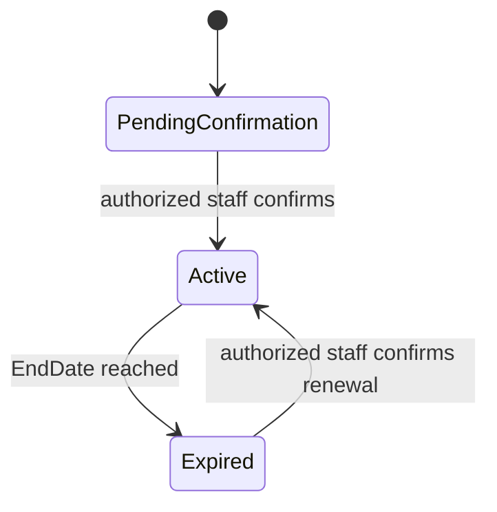

# Provider Subscription Model — MVP

> **الحالة:** `ANALYZED_APPROVED — SYNCHRONIZED 2026-09-18 THROUGH DEC-086`
>
> **القرارات المرجعية:** DEC-042/043/086.

## 1. القرار

يعتمد YADD في الـMVP اشتراكًا دوريًا لمقدمي الخدمات/المنتجات كجزء فعلي من النظام، لكن **تحصيل قيمة الاشتراك لا يتم عبر Payment Gateway داخل YADD**.

يدفع المقدم خارج النظام بالطريقة التشغيلية التي تعتمدها إدارة YADD، ثم يقوم موظف مخول بتأكيد الاشتراك أو التجديد يدويًا داخل النظام.

هذا المسار منفصل كليًا عن معاملات المستفيدين مع مقدمي الخدمات/المنتجات، ولا يغير قرار عدم وجود عمولة على تلك المعاملات.

## 2. الحد الأدنى من بيانات الاشتراك

يحتاج النظام مفهوميًا إلى سجل اشتراك مرتبط بـProvider Profile يتضمن على الأقل:

- `Status`
- `StartDate`
- `EndDate`

يعتمد MVP خطة تشغيلية واحدة مدتها **30 يومًا**. السعر النهائي ووسيلة إثبات الدفع الخارجي ما يزالان قرارين تشغيليين/تجاريين منفصلين.

## 3. دورة الاشتراك المفاهيمية

هذه دورة مفاهيمية للـMVP، وليست تصميم قاعدة بيانات نهائيًا.

## 4. التفعيل والتجديد

- لا يفعّل النظام الاشتراك تلقائيًا بناءً على عملية دفع إلكترونية داخل YADD.
- موظف YADD المخول يؤكد التفعيل أو التجديد يدويًا بعد التحقق من الدفع الخارجي وفق الإجراء التشغيلي المعتمد.
- لا يحتاج الـMVP إلى Payment Gateway أو Webhook خاص بتحصيل اشتراك المقدم.
- عند التفعيل يسجل النظام مدة 30 يومًا من `StartDate` إلى `EndDate`.
- يرسل Reminder قبل EndDate بـ3 أيام وآخر قبل 24 ساعة.

## 5. أثر حالة الاشتراك

- الاشتراك Active مطلوب لكلا نوعي Provider قبل إرسال Provider Response جديدة أو بدء Direct Transaction جديدة.
- Service Provider يحتاج كذلك Identity Verified؛ Product Provider لا يحتاج Government ID وفق DEC-085.
- عند `Expired` لا يستطيع المقدم إرسال عروض جديدة أو بدء Direct Transaction جديدة حتى التجديد.
- المعاملات التي بدأت قبل الانتهاء تستمر، ويمكن للمقدم تسجيل الدخول ومتابعتها وتجديد الاشتراك.
- بقي أثر Expired على الظهور العام في نتائج البحث مفتوحًا فقط.

## 6. الحدود المالية

- اشتراك المقدم هو علاقة مالية بين المقدم ومنصة YADD، وليس جزءًا من قيمة معاملات المستفيدين.
- YADD لا يأخذ عمولة من معاملة المستفيد مع المقدم.
- لا يؤدي هذا القرار إلى إدخال معالجة مدفوعات المستفيدين داخل YADD.
- وسيلة تحصيل الاشتراك خارجيًا، وإثبات الدفع المقبول، والإجراءات المحاسبية التفصيلية لم تعتمد بعد.

## 7. قواعد معتمدة

- `SUB-BR-01`: يعتمد نموذج YADD التجاري على اشتراك دوري من مقدمي الخدمات/المنتجات دون عمولة على معاملات المستفيدين.
- `SUB-BR-02`: يدير النظام حالة وفترة اشتراك Provider Profile داخل YADD في الـMVP.
- `SUB-BR-03`: تحصيل قيمة الاشتراك يتم خارج YADD في الـMVP، ولا يوجد Payment Gateway مدمج لتحصيل اشتراك المقدم.
- `SUB-BR-04`: تفعيل الاشتراك أو تجديده يتم يدويًا بواسطة موظف YADD مخول بعد التحقق التشغيلي من الدفع الخارجي.
- `SUB-BR-05`: Active Subscription مطلوب لكلا نوعي Provider قبل تعاملات جديدة؛ Service Provider يخضع أيضًا لـIdentity Verification.
- `SUB-BR-06`: Expired يمنع Provider Response وDirect Transaction الجديدة لكنه لا يوقف المعاملات الجارية.
- `SUB-BR-07`: مدة الاشتراك 30 يومًا مع Reminder قبل 3 أيام و24 ساعة.

## 8. أسئلة فرعية باقية

- `SUB-PLAN-Q01`: ما السعر النهائي للاشتراك الشهري؟
- `SUB-PAY-Q01`: ما وسائل وإجراءات الدفع الخارجي المقبولة وكيف يثبت المقدم الدفع للإدارة؟
- `SUB-OPS-Q01`: هل يبقى Provider ظاهرًا في البحث العام عندما يكون الاشتراك Expired؟
