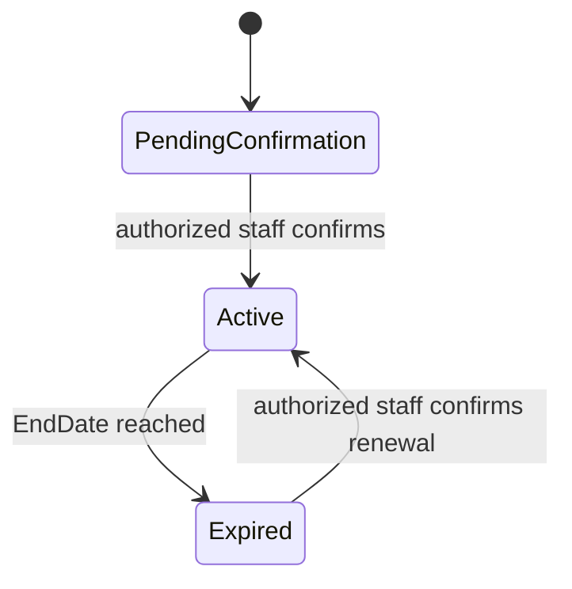

# Provider Subscription Model — MVP

> **الحالة:** `ANALYZED_APPROVED`
>
> **القرار المرجعي:** `SUB-Q02` — قرار الفريق 2026-08-12.

## 1. القرار

يعتمد YADD في الـMVP اشتراكًا دوريًا لمقدمي الخدمات/المنتجات كجزء فعلي من النظام، لكن **تحصيل قيمة الاشتراك لا يتم عبر Payment Gateway داخل YADD**.

يدفع المقدم خارج النظام بالطريقة التشغيلية التي تعتمدها إدارة YADD، ثم يقوم موظف مخول بتأكيد الاشتراك أو التجديد يدويًا داخل النظام.

هذا المسار منفصل كليًا عن معاملات المستفيدين مع مقدمي الخدمات/المنتجات، ولا يغير قرار عدم وجود عمولة على تلك المعاملات.

## 2. الحد الأدنى من بيانات الاشتراك

يحتاج النظام مفهوميًا إلى سجل اشتراك مرتبط بـProvider Profile يتضمن على الأقل:

- `Status`
- `StartDate`
- `EndDate`

وقد يرتبط بخطة/باقة اشتراك عند اعتماد نموذج الباقات والأسعار لاحقًا.

> عدد الخطط، أسماؤها، أسعارها، ومددها الدقيقة لم تعتمد بعد.

## 3. دورة الاشتراك المفاهيمية

هذه دورة مفاهيمية للـMVP، وليست تصميم قاعدة بيانات نهائيًا.

## 4. التفعيل والتجديد

- لا يفعّل النظام الاشتراك تلقائيًا بناءً على عملية دفع إلكترونية داخل YADD.
- موظف YADD المخول يؤكد التفعيل أو التجديد يدويًا بعد التحقق من الدفع الخارجي وفق الإجراء التشغيلي المعتمد.
- لا يحتاج الـMVP إلى Payment Gateway أو Webhook خاص بتحصيل اشتراك المقدم.
- عند التفعيل يسجل النظام مدة الاشتراك من `StartDate` إلى `EndDate`.

## 5. أثر حالة الاشتراك

- يتطلب إرسال عروض جديدة كمقدم أن يكون Provider Profile متحققًا وأن يكون اشتراكه `Active`.
- عند وصول الاشتراك إلى `Expired` لا يستطيع المقدم إرسال عروض جديدة حتى تجديد الاشتراك.
- الأثر الدقيق لانتهاء الاشتراك على الظهور في نتائج البحث أو على المعاملات التي بدأت قبل انتهاء الاشتراك لم يعتمد بعد، ويجب ألا يفترض تلقائيًا.

## 6. الحدود المالية

- اشتراك المقدم هو علاقة مالية بين المقدم ومنصة YADD، وليس جزءًا من قيمة معاملات المستفيدين.
- YADD لا يأخذ عمولة من معاملة المستفيد مع المقدم.
- لا يؤدي هذا القرار إلى إدخال معالجة مدفوعات المستفيدين داخل YADD.
- وسيلة تحصيل الاشتراك خارجيًا، وإثبات الدفع المقبول، والإجراءات المحاسبية التفصيلية لم تعتمد بعد.

## 7. قواعد معتمدة

- `SUB-BR-01`: يعتمد نموذج YADD التجاري على اشتراك دوري من مقدمي الخدمات/المنتجات دون عمولة على معاملات المستفيدين.
- `SUB-BR-02`: يدير النظام حالة وفترة اشتراك Provider Profile داخل YADD في الـMVP.
- `SUB-BR-03`: تحصيل قيمة الاشتراك يتم خارج YADD في الـMVP، ولا يوجد Payment Gateway مدمج لتحصيل اشتراك المقدم.
- `SUB-BR-04`: تفعيل الاشتراك أو تجديده يتم يدويًا بواسطة موظف YADD مخول بعد التحقق التشغيلي من الدفع الخارجي.
- `SUB-BR-05`: إرسال عروض جديدة يتطلب Provider Profile متحققًا واشتراكًا `Active`.
- `SUB-BR-06`: عند انتهاء الاشتراك يمنع المقدم من إرسال عروض جديدة حتى التجديد.

## 8. أسئلة فرعية باقية

- `SUB-PLAN-Q01`: ما الباقات/الأسعار/المدد الفعلية للاشتراك؟
- `SUB-PAY-Q01`: ما وسائل وإجراءات الدفع الخارجي المقبولة وكيف يثبت المقدم الدفع للإدارة؟
- `SUB-OPS-Q01`: ما الأثر الدقيق لانتهاء الاشتراك على الظهور في البحث والمعاملات الجارية قبل الانتهاء؟
