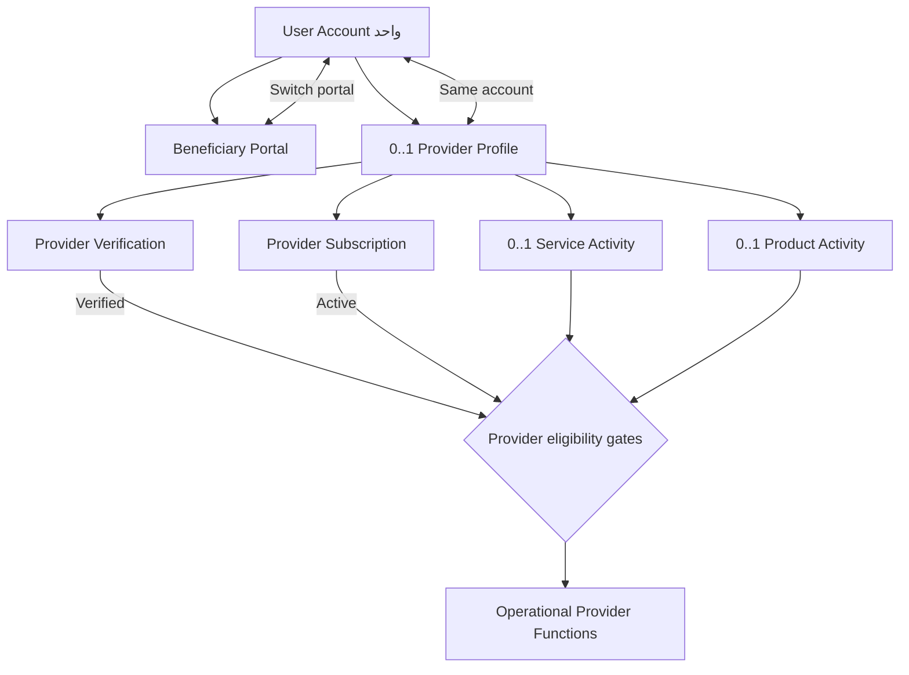
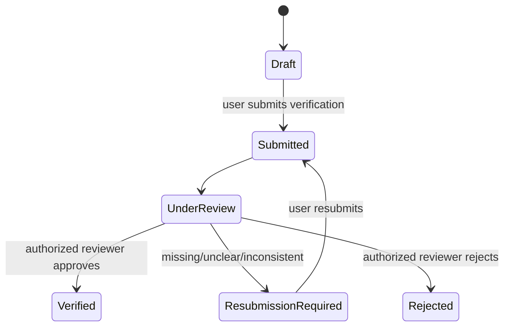
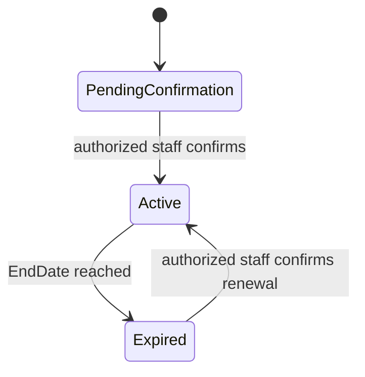

# User Roles, States & Permissions — YADD MVP

> **الحالة:** `ANALYZED_APPROVED` في الأجزاء المشتقة مباشرة من القرارات والمتطلبات المعتمدة، مع تمييز النقاط المفتوحة داخل الوثيقة.
>
> **الغرض:** توضيح كيف يستخدم الشخص حسابًا واحدًا في YADD، وكيف ينتقل من استخدام المنصة كمستفيد إلى تفعيل وظائف مقدم الخدمة/المنتج، وما الصلاحيات التي تتاح في كل مرحلة.
>
> **المراجع الأساسية:** `DEC-008..011`, `DEC-029..030`, `DEC-034..036`, `DEC-042..043`, `05-SRS.md`, `14-account-portal-model.md`, `19-provider-activity-model.md`, `21-provider-verification-model.md`, `23-provider-subscription-model.md`.

## 1. الخلاصة التنفيذية

يعتمد YADD **حساب `User` واحدًا للشخص**. لا يتحول الحساب من «حساب مستفيد» إلى «حساب مقدم» ولا تنشأ للمستخدم هوية حساب ثانية. اختيار «مستفيد» أو «مقدم» عند البداية يحدد بوابة الاستخدام الأولية فقط.

إذا أراد المستخدم ممارسة وظائف التقديم، فإنه ينشئ `Provider Profile` داخل حسابه نفسه، ويختار النشاط المناسب (`Service Activity` أو `Product Activity` أو كليهما)، ثم يستكمل التحقق الرسمي. بعد اعتماد التحقق يصبح الملف `Verified`، إلا أن **إرسال عروض جديدة** يتطلب أيضًا اشتراك مقدم بحالة `Active`، إضافة إلى تحقق شروط النشاط والمنطقة والطلب المفتوح.

بالتالي، الزيادة في الصلاحيات ليست نتيجة تغيير نوع الحساب، بل نتيجة استيفاء **بوابات أهلية Authorization Gates** مرتبطة بـ`Provider Profile`.

## 2. الفرق بين الحساب والبوابة والدور والحالة

| المفهوم | معناه في YADD | الحالة |
|---|---|---|
| `User Account` | هوية الحساب الوحيدة للشخص داخل المنصة. | `APPROVED` |
| `Beneficiary Portal` | واجهة استخدام وظائف الاستفادة من الخدمات/المنتجات. | `APPROVED` |
| `Provider Portal` | واجهة إعداد/استخدام وظائف مقدم الخدمة أو المنتج داخل الحساب نفسه. | `APPROVED` |
| `Provider Profile` | ملف مقدم مرتبط بـ`User`، وليس حسابًا مستقلًا. | `APPROVED` |
| `Service Activity` | نشاط يتيح للمقدم العمل ضمن مسار الخدمات عند استيفاء بقية شروط الأهلية. | `APPROVED` |
| `Product Activity` | نشاط يتيح للمقدم العمل ضمن مسار المنتجات عند استيفاء بقية شروط الأهلية. | `APPROVED` |
| `Provider Verification Status` | حالة تحقق هوية المقدم ومراجعته من YADD. | `APPROVED` |
| `Provider Subscription Status` | حالة اشتراك المقدم وفترة صلاحيته. | `APPROVED` |
| `Beneficiary` / `Service Provider` / `Product Provider` | Actors سياقية في المتطلبات، وليست أنواع حسابات دائمة منفصلة. | `ANALYZED_APPROVED` |

## 3. النموذج المفاهيمي للحساب



> الرسم مفاهيمي لتحليل الصلاحيات، وليس ERD أو تصميم قاعدة بيانات نهائيًا.

## 4. رحلة المستخدم من مستفيد إلى مقدم

### 4.1 إنشاء الحساب واختيار بوابة البداية

1. ينشئ الشخص/يستخدم حساب `User` واحدًا.
2. عند أول استخدام يختار أن يبدأ من بوابة المستفيد أو بوابة المقدم.
3. هذا الاختيار لا ينشئ `Account Type` دائمًا ولا يمنع الانتقال بين البوابتين لاحقًا.

**الحالة:** `APPROVED` وفق `DEC-008..011`.

> **NEEDS_VERIFICATION:** الحقول النهائية للتسجيل، خطوات تفعيل الحساب العامة، وآلية التحقق من رقم الهاتف أثناء التسجيل لم تثبت في SRS كدورة تسجيل تفصيلية مستقلة حتى الآن.

### 4.2 استخدام الحساب كمستفيد

يستطيع الحساب استخدام وظائف المستفيد المعتمدة، ومنها:

- البحث المباشر عن مقدمي النشاط حسب التصنيف والمنطقة.
- إنشاء طلب خدمة أو منتج ونشره.
- إضافة وصف وصور اختيارية وسعر استرشادي اختياري للطلب.
- تحديد المديرية والحي ومدة صلاحية الطلب.
- مقارنة استجابات المقدمين واختيار مقدم واحد.
- استخدام `Transaction Chat` بعد اختيار المقدم.
- مراجعة الفاتورة واعتمادها أو طلب تعديلها.
- رفع شكوى عند استمرار الخلاف قبل اعتماد الفاتورة.
- تقييم مقدم الخدمة/المنتج بعد إغلاق معاملة مؤهلة.

**الحالة:** `ANALYZED_APPROVED` وفق SRS والقواعد التجارية الحالية.

### 4.3 بدء تفعيل وظائف المقدم

إذا أراد المستخدم التقديم، فلا ينشئ حسابًا جديدًا؛ بل:

1. ينشئ/يستكمل `Provider Profile` داخل حساب `User` نفسه.
2. يفعّل `Service Activity` أو `Product Activity` أو كليهما.
3. يحدد بيانات النشاط ومناطق الخدمة المطلوبة وفق المتطلبات المعتمدة.
4. يرسل طلب `Provider Verification`.

وجود `Provider Profile` أو نشاط مفعّل **لا يعني وحده** السماح للمستخدم بممارسة وظائف التقديم التشغيلية.

### 4.4 التحقق من مقدم الخدمة/المنتج

يمر طلب التحقق بالحالات المفاهيمية التالية:



الحد الأدنى المعتمد لطلب التحقق يشمل وثيقة هوية رسمية وصورة شخصية مع الوثيقة وبيانات الحساب اللازمة للمطابقة. القرار النهائي بالتفعيل أو إعادة التقديم أو الرفض يتخذه موظف YADD مخول، ولا يصدر من AI وحده.

قبل `Verified` يستطيع صاحب الحساب الاستمرار كمستفيد، لكنه لا يستطيع ممارسة وظائف المقدم التشغيلية.

### 4.5 الاشتراك وتفعيل إرسال العروض

بعد تحقق `Provider Profile`، يدير YADD سجل اشتراك للمقدم. دورة الاشتراك المفاهيمية هي:



تحصيل الاشتراك يتم خارج YADD في MVP ويؤكده موظف مخول يدويًا داخل النظام.

**الشرط المعتمد لإرسال عرض جديد:**

```text
Provider Profile = Verified
AND Subscription = Active
AND Required Activity = Enabled
AND Provider Area = Eligible
AND Request = Open
```

هذا هو التفسير الدقيق لمعنى أن المستخدم «أصبح لديه صلاحيات مقدم» في المسار المعتمد حاليًا.

## 5. مصفوفة الصلاحيات

الرموز:

- ✅ مسموح وفق المتطلبات الحالية.
- ❌ غير مسموح وفق قرار صريح.
- ⚠️ مشروط أو يحتاج استكمال قرار.

| الوظيفة | User بلا Provider Profile | Provider Profile غير متحقق | Verified بدون اشتراك Active | Verified + Active | ملاحظة |
|---|---:|---:|---:|---:|---|
| استخدام بوابة المستفيد | ✅ | ✅ | ✅ | ✅ | الحساب نفسه يستطيع الاستفادة والتقديم. |
| البحث عن خدمات/منتجات | ✅ | ✅ | ✅ | ✅ | وظيفة مستفيد. |
| إنشاء طلب ونشره | ✅ | ✅ | ✅ | ✅ | وظيفة مستفيد ولا تتطلب Provider Profile. |
| إنشاء Provider Profile | ✅ | — | — | — | ملف واحد كحد أقصى لكل User. |
| تفعيل Service/Product Activity داخل الملف | ❌ | ✅ | ✅ | ✅ | التفعيل لا يمنح صلاحيات تشغيلية قبل التحقق. |
| إرسال طلب Provider Verification | ❌ | ✅ | — | — | مرتبط بـProvider Profile. |
| متابعة حالة التحقق/إعادة التقديم | ❌ | ✅ | ✅ | ✅ | حسب حالة الطلب. |
| ممارسة وظائف المقدم قبل Verified | ❌ | ❌ | — | — | منع صريح. |
| تحديد مناطق الخدمة | ❌ | ✅ | ✅ | ✅ | جزء من إعداد أهلية المقدم؛ الأهلية الفعلية تعتمد على الطلب. |
| رؤية طلبات النشاط المؤهلة | ❌ | ⚠️ | ✅/⚠️ | ✅ | التحقق والنشاط والمنطقة شروط أساسية؛ أثر انتهاء الاشتراك على الرؤية لم يحسم في `SUB-OPS-Q01`. |
| إرسال عرض جديد | ❌ | ❌ | ❌ | ✅ | يتطلب أيضًا النشاط المناسب والمنطقة المؤهلة وطلبًا Open. |
| سحب عرض قبل الاختيار | ❌ | ❌ | ⚠️ | ✅ | مرتبط بوجود عرض مرسل سابقًا؛ أثر انتهاء الاشتراك بعد الإرسال لم يحسم. |
| استخدام Transaction Chat كمقدم | ❌ | ❌ | ⚠️ | ✅ | يتاح بعد اختيار المقدم؛ أثر انتهاء الاشتراك أثناء معاملة جارية لم يحسم. |
| إنشاء الفاتورة النهائية | ❌ | ❌ | ⚠️ | ✅ | مرتبط بمعاملة مختارة وبعد التنفيذ/التجهيز؛ `SUB-OPS-Q01` مفتوح إذا انتهى الاشتراك أثناء المعاملة. |
| تقييم المستفيد | ❌ | ❌ | ⚠️ | ✅ | يتطلب معاملة مغلقة مؤهلة؛ أثر الاشتراك المنتهي على معاملة قائمة غير محسوم. |

## 6. الصلاحيات التي تضاف فعليًا عند تفعيل المقدم

لا يضاف إلى `User` «Role دائم» باسم مقدم بصورة تفصل الحساب عن المستفيد. بدلًا من ذلك، تصبح وظائف المقدم متاحة بحسب حالة `Provider Profile` والسياق.

### 6.1 بعد إنشاء Provider Profile وقبل التحقق

تتاح وظائف الإعداد فقط، مثل:

- استكمال Provider Profile.
- اختيار/إعداد النشاط المناسب.
- تحديد مناطق الخدمة وفق النموذج المعتمد.
- تقديم متطلبات التحقق.
- متابعة حالة طلب التحقق وإعادة التقديم عند الطلب.

ولا تتاح وظائف التشغيل التي تجعل المستخدم يتعامل مع طلبات المستفيدين كمقدم.

### 6.2 بعد `Verified`

يصبح المستخدم مقدمًا متحققًا من حيث الهوية داخل YADD، لكن **إرسال العروض الجديدة** ما يزال محكومًا بحالة الاشتراك.

### 6.3 بعد `Verified + Active Subscription`

عند استيفاء بقية شروط النشاط والمنطقة والطلب، تتاح صلاحيات تشغيلية مثل:

- الاستجابة لطلب مؤهل وإرسال عرض.
- إدخال/اقتراح سعر مختلف عن السعر الاسترشادي.
- إضافة ملاحظات مرتبطة بالعرض.
- بعد اختياره: استخدام Transaction Chat المرتبط بالمعاملة.
- تنفيذ دورة المعاملة داخل النظام حتى إنشاء الفاتورة.
- إنشاء وإرسال الفاتورة النهائية.
- التعامل مع طلبات تعديل الفاتورة قبل اعتمادها.
- تقييم المستفيد بعد إغلاق معاملة مؤهلة.

> لا تشمل هذه الصلاحيات `Portfolio/كتالوج مقدم` كميزة معتمدة؛ هذا البند ما يزال `PROPOSED` وفق Decision Register.

## 7. أدوار موظفي YADD ذات الصلة

هذه الأدوار منفصلة عن نموذج حساب المستخدم العادي/المقدم:

| الدور | الصلاحية الأساسية | الحالة |
|---|---|---|
| `Verification Reviewer` | مراجعة طلبات التحقق واتخاذ قرار Verified / ResubmissionRequired / Rejected. | `ANALYZED_APPROVED` |
| `Subscription Administrator` | تأكيد تفعيل/تجديد اشتراك المقدم وتسجيل فترة الصلاحية بعد التحقق التشغيلي من الدفع الخارجي. | `ANALYZED_APPROVED` |
| `Content Moderator` | مراجعة المحتوى وAI Flags والحالات الحساسة وفق السياسة. | `ANALYZED_APPROVED` في أصل الدور، التفاصيل جزئية. |
| `Platform Administrator` | صلاحيات إدارية أوسع. | `PARTIALLY_ANALYZED` |

## 8. حالات الأهلية المهمة للمقدم

يمكن التعبير عن حالة المستخدم بالنسبة للتقديم كتركيب من عدة حالات، لا كحقل Role واحد:

```text
ProviderOperationalEligibility =
    ProviderProfile exists
    + VerificationStatus
    + EnabledActivity
    + ServiceArea eligibility
    + SubscriptionStatus
    + Transaction/Request context
```

أمثلة:

- `Provider Profile موجود + UnderReview` → يستطيع إعداد الملف ومتابعة التحقق فقط، ويظل قادرًا على استخدام المنصة كمستفيد.
- `Verified + Subscription Expired` → لا يستطيع إرسال عروض جديدة.
- `Verified + Active + Service Activity + eligible area` → يستطيع إرسال عرض لطلب خدمة Open مؤهل.
- `Verified + Active + Product Activity` → يستطيع التعامل كمقدم منتج ضمن متطلبات مسار المنتجات.
- `Verified + Active + Service Activity + Product Activity` → يستطيع العمل في المسارين من Provider Profile نفسه.

## 9. نقاط تحتاج قرارًا أو تحققًا

| ID/الموضوع | الحالة | الأثر على الصلاحيات |
|---|---|---|
| تفاصيل تسجيل الحساب العامة | `NEEDS_VERIFICATION` | لا يمكن توثيق حقول التسجيل والتفعيل العام كمسار نهائي بعد. |
| `SUB-OPS-Q01` | `PROPOSED` | أثر انتهاء الاشتراك على الظهور في البحث والمعاملات الجارية غير محسوم. |
| `SUB-PLAN-Q01` | `PROPOSED` | الباقات والأسعار والمدد الفعلية غير معتمدة. |
| `SUB-PAY-Q01` | `PROPOSED` | وسيلة إثبات/إجراء دفع الاشتراك الخارجي غير معتمدة. |
| `VER-DOC-Q01` | `PROPOSED` | أنواع وثائق الهوية المقبولة والجوانب المطلوبة لم تعتمد. |
| `VER-LIC-Q01` | `NEEDS_VERIFICATION` | الأنشطة التي قد تتطلب ترخيصًا مهنيًا إضافيًا غير محددة. |
| Portfolio/كتالوج المقدم | `PROPOSED` | لا يضاف إلى مصفوفة الصلاحيات المعتمدة حتى يقرر الفريق نطاقه. |

## 10. إجابة مختصرة على سؤال المشرف

**كيف يتحول المستخدم العادي إلى مستخدم لديه خدمة/صلاحيات مقدم؟**

لا يتحول إلى نوع حساب آخر. يبقى `User` نفسه، وينشئ `Provider Profile` داخله. يفعّل نشاط الخدمة أو المنتج، ويقدم مستندات التحقق. بعد أن يراجعه موظف YADD ويصبح `Verified`، ثم يصبح اشتراكه `Active`، تتاح له صلاحيات تشغيلية للمقدم عند تحقق النشاط والمنطقة وسياق الطلب، وأهمها إرسال العروض والتعامل مع المعاملة وإنشاء الفاتورة والتقييم. وفي جميع هذه المراحل يبقى قادرًا على استخدام بوابة المستفيد بالحساب نفسه.
