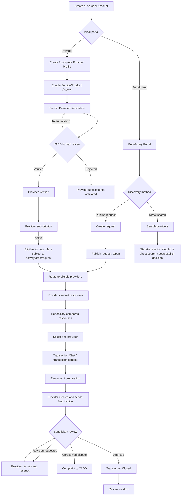
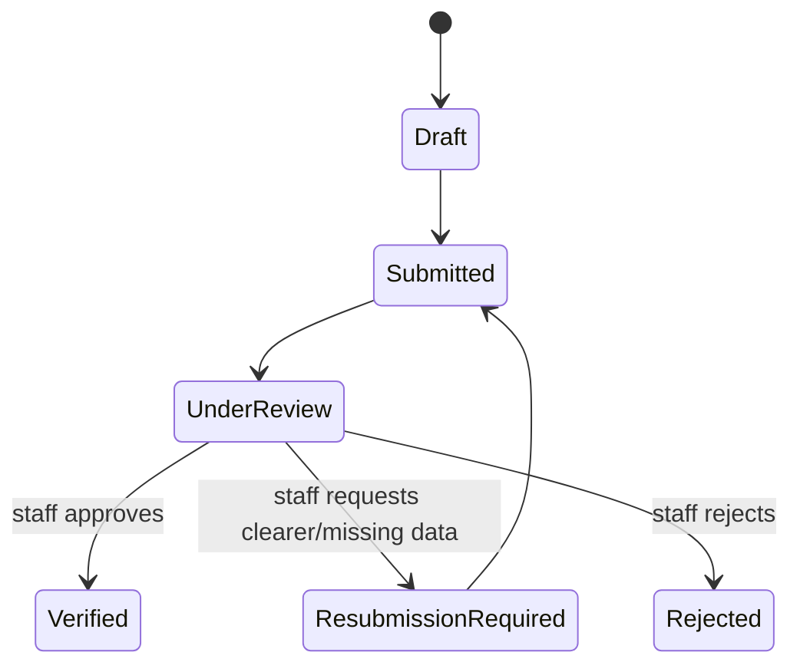
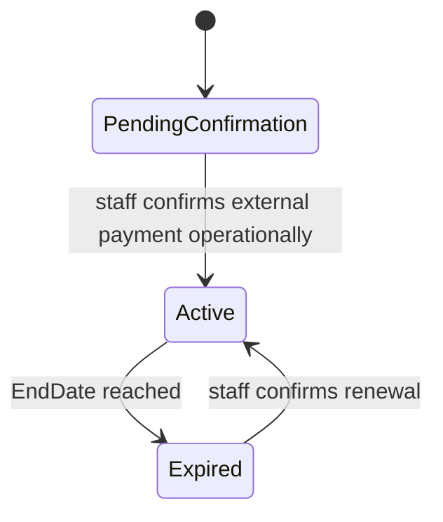
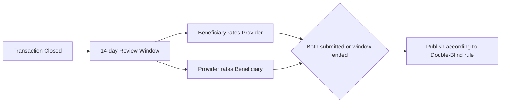
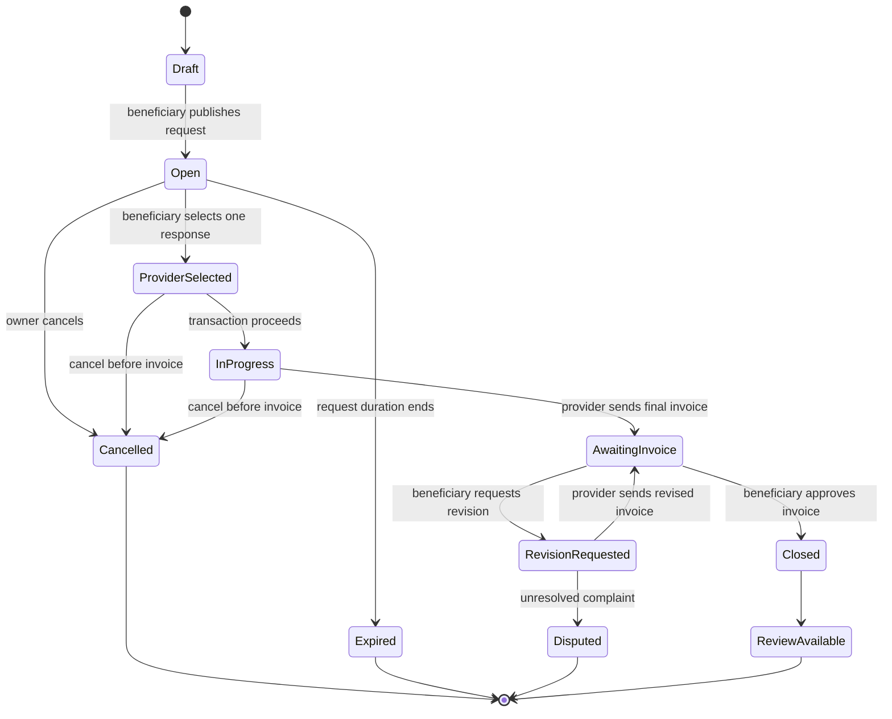

# End-to-End System Workflow — YADD MVP

> **الحالة:** `PARTIALLY_ANALYZED` لأن المسار الأساسي للطلبات والمعاملات معتمد بدرجة عالية، بينما توجد فجوات محددة موضحة صراحة في قسم النقاط المفتوحة.
>
> **الغرض:** شرح الدورة التشغيلية/المستندية للنظام من إنشاء الحساب واختيار البوابة، مرورًا بتفعيل المقدم ونشر الطلب واختيار مقدم وتنفيذ المعاملة، حتى الفاتورة والإغلاق والتقييم.
>
> **المراجع الأساسية:** Decision Register، `05-SRS.md`, `06-business-rules.md`, `14-account-portal-model.md`, `15-invoice-approval-and-dispute.md`, `16-in-app-transaction-communication.md`, `17-request-cancellation-expiry.md`, `18-rating-reputation-model.md`, `19-provider-activity-model.md`, `20-location-and-neighborhood-model.md`, `21-provider-verification-model.md`, `23-provider-subscription-model.md`.

## 1. حدود هذه الدورة

تصف الوثيقة ما يحدث **داخل YADD** وما هي الأحداث التي يدوّنها النظام. وهي لا تفترض أن YADD:

- ينفذ مدفوعات المستفيد للمقدم.
- يحتفظ بالأموال أو يتحقق من دفعها.
- يدير توصيل المنتجات أو السائقين أو تتبع الشحنات.
- يضمن قانونيًا تنفيذ الاتفاقات خارج المنصة.

السجل النهائي لبنود وأسعار المعاملة داخل YADD هو الفاتورة النهائية التي يرسلها المقدم ويعتمدها المستفيد.

## 2. الصورة العامة للدورة



## 3. المرحلة الأولى: إنشاء الحساب واختيار بوابة البداية

### 3.1 الحد المعتمد

1. يمتلك الشخص حساب `User` واحدًا فقط داخل YADD.
2. عند أول استخدام يختار بوابة البداية: مستفيد أو مقدم.
3. اختيار البداية يغير تجربة الـOnboarding والواجهة الأولية، ولا ينشئ نوع حساب دائمًا.
4. يستطيع المستخدم لاحقًا استخدام بوابة المستفيد، وإذا استوفى شروط المقدم يستطيع الانتقال إلى بوابة المقدم بالحساب نفسه.

### 3.2 ما لا يزال غير موثق تفصيليًا

`NEEDS_VERIFICATION`:

- الحقول النهائية لنموذج التسجيل العام.
- هل توجد خطوة تفعيل حساب عامة قبل الدخول، وما آليتها النهائية.
- تسلسل التحقق من رقم الهاتف أثناء التسجيل بصورة مستقلة عن Provider Verification.

لذلك تبدأ هذه الوثيقة تشغيليًا من حدث **إنشاء/وجود User Account صالح للاستخدام** دون اختراع حقول أو خطوات تسجيل لم تعتمد بعد.

## 4. المرحلة الثانية: إذا أراد المستخدم أن يصبح مقدمًا

هذه المرحلة يمكن أن يبدأها المستخدم منذ البداية إذا اختار بوابة المقدم، أو لاحقًا من حسابه إذا بدأ كمستفيد.

### 4.1 إنشاء Provider Profile

1. يفتح المستخدم مسار إعداد المقدم من حسابه الحالي.
2. ينشئ `Provider Profile` واحدًا كحد أقصى.
3. يختار النشاط:
   - `Service Activity`، أو
   - `Product Activity`، أو
   - كليهما.
4. يحدد البيانات التشغيلية المعتمدة، ومنها مناطق الخدمة على مستوى المديريات/الأحياء حسب نموذج الموقع.

### 4.2 تقديم طلب التحقق

يرفع المستخدم الحد الأدنى المعتمد من متطلبات التحقق:

- وثيقة هوية رسمية.
- صورة شخصية مع الوثيقة.
- بيانات الحساب اللازمة للمطابقة.

ثم يرسل الطلب.

### 4.3 مراجعة التحقق

الحالات المفاهيمية:



- يمكن للـAI تنفيذ فحوص مساعدة وإنتاج Flags.
- القرار النهائي بشري ومن موظف YADD مخول.
- قبل `Verified` لا تتاح وظائف التقديم التشغيلية.
- أثناء الانتظار أو الرفض يبقى الحساب قادرًا على العمل كمستفيد.

### 4.4 تفعيل الاشتراك

بعد/مع استكمال أهلية المقدم، يكون للمقدم سجل اشتراك داخل YADD:



- الدفع الفعلي للاشتراك خارج YADD.
- موظف مخول يؤكد التفعيل/التجديد يدويًا.
- الاشتراك `Active` شرط معتمد لإرسال **عروض جديدة**.

### 4.5 بوابة أهلية إرسال العرض

لكي يرسل المستخدم عرضًا على طلب، يجب أن تتحقق الشروط التالية معًا:

```text
Verification = Verified
Subscription = Active
Required Activity = Enabled
Request Area = within eligible service area
Request Status = Open
```

## 5. المرحلة الثالثة: اكتشاف الخدمة/المنتج من جانب المستفيد

يعتمد YADD مسارين للاكتشاف.

### 5.1 المسار A — البحث المباشر

المعتمد حاليًا:

1. يبحث المستفيد عن مقدمي خدمات/منتجات.
2. يستخدم التصنيف والمديرية/الحي ضمن البحث/المطابقة.

**فجوة تحليلية:** الوثائق الحالية لا تحدد بصورة كافية الحدث الذي يحول نتيجة البحث المباشر إلى معاملة رسمية داخل YADD. أي خطوة مثل «طلب هذا المقدم مباشرة» أو «فتح معاملة/دعوة خاصة» تحتاج قرارًا صريحًا قبل إضافتها إلى SRS أو Use Cases.

الحالة: `NEEDS_DECISION / NEEDS_VERIFICATION`.

### 5.2 المسار B — إنشاء طلب ونشره

هذا هو المسار الأكثر اكتمالًا وتحليلًا حاليًا.

#### إنشاء الطلب

ينشئ المستفيد طلب خدمة أو منتج ويحدد:

- الفئة/التصنيف.
- وصف الطلب.
- المديرية.
- الحي.
- صور أو معلومات توضيحية بصورة اختيارية.
- سعرًا استرشاديًا بصورة اختيارية.
- مدة صلاحية الطلب.

لا يظهر العنوان الدقيق أو GPS في الطلب العام.

#### نشر الطلب

عند النشر:

```text
Draft -> Open
```

ويبدأ النظام بتوجيه/إظهار الطلب للمقدمين المؤهلين حسب النشاط والمنطقة.

## 6. المرحلة الرابعة: توزيع الطلب واستجابات المقدمين

### 6.1 المطابقة الجغرافية

1. يبدأ توزيع الطلب في حي الطلب.
2. يشاهد/يتعامل معه مقدمو النشاط المؤهلون وفق نموذج المنطقة.
3. إذا مرت مدة تشغيلية دون استجابة مناسبة، يعرض YADD على المستفيد اقتراح توسيع النطاق إلى الأحياء المجاورة.
4. لا يحدث التوسع تلقائيًا؛ يحتاج موافقة المستفيد الصريحة.
5. تعرض للمستفيد ملاحظة أن اختلاف المنطقة قد يؤثر على السعر أو تكلفة الانتقال/التوصيل بحسب الحالة.

> المدة الرقمية الدقيقة قبل اقتراح التوسع ما تزال `PROPOSED` عبر `LOC-OPS-TIME-Q01`.

### 6.2 استجابة المقدم

إذا كان المقدم مؤهلًا وكان اشتراكه `Active`:

1. يفتح الطلب `Open`.
2. يراجع تفاصيله.
3. إذا وجد سعرًا استرشاديًا، يمكنه قبوله أو اقتراح سعر آخر.
4. يمكنه إضافة ملاحظات مرتبطة بالعرض.
5. يرسل الاستجابة/العرض.
6. تصبح الاستجابة `Submitted`.

يمكن للمقدم سحب عرضه قبل أن يختاره المستفيد.

### 6.3 انتهاء الطلب دون اختيار

يبقى الطلب `Open` إلى أن يحدث أحد الآتي:

- يختار المستفيد مقدمًا.
- يلغي المستفيد الطلب.
- تنتهي المدة التي حددها المستفيد.

إذا انتهت المدة دون اختيار مقدم:

```text
Open -> Expired
```

ولا يقبل الطلب استجابات جديدة.

## 7. المرحلة الخامسة: مقارنة الاستجابات واختيار مقدم

1. يستقبل المستفيد استجابات مقدمي الخدمات/المنتجات.
2. يقارن بين الاستجابات.
3. يمكن أن تظهر له معلومات مثل السعر المقترح والتقييم عندما تكون متاحة.
4. يختار استجابة مقدم واحد للمتابعة.
5. تنتقل العملية إلى سياق معاملة مع المقدم المختار.

```text
Open -> ProviderSelected
```

الاستجابات الأخرى تصبح غير مختارة عند إغلاق مرحلة الاختيار.

> خوارزمية ترتيب الاستجابات نفسها ليست قرارًا معتمدًا حتى الآن.

## 8. المرحلة السادسة: بدء المعاملة والتواصل

بعد اختيار المقدم:

1. يتيح النظام `Transaction Chat` خاصًا بالمعاملة بين الطرفين.
2. يمكن للطرفين مناقشة السعر والتفاصيل ونطاق العمل.
3. يمكن إرسال صور/مرفقات مرتبطة بالمعاملة.
4. يمكن للمستفيد مشاركة موقع أدق/Pin مع المقدم المختار عند الحاجة.
5. تحفظ المحادثة كسجل رسمي داخل YADD يمكن الرجوع إليه عند النزاع.

لكن المحادثة لا تستبدل الفاتورة النهائية. إذا تغير السعر أو نطاق العمل أثناء النقاش، يجب أن ينعكس الاتفاق النهائي في الفاتورة كي يصبح جزءًا من السجل النهائي للمعاملة داخل YADD.

### 8.1 حالة InProgress

النموذج الحالي يستخدم الانتقال:

```text
ProviderSelected -> InProgress
```

**NEEDS_VERIFICATION:** الحدث التشغيلي الدقيق الذي يحدد لحظة هذا الانتقال — هل يتم تلقائيًا مباشرة بعد الاختيار أم بعد إجراء/تأكيد إضافي — لم يوثق بصورة مستقلة وحاسمة حتى الآن. لذلك لا ينبغي اختراع زر أو تأكيد جديد قبل قرار الفريق.

## 9. المرحلة السابعة: التنفيذ أو التجهيز

### 9.1 الخدمة

ينفذ مقدم الخدمة العمل المتفق عليه في الواقع، بينما تستخدم المنصة المحادثة والسجلات لتوثيق ما يتعلق بالمعاملة.

### 9.2 المنتج

يجري تجهيز/تنفيذ طلب المنتج. طريقة الاستلام يمكن أن تكون:

- الاستلام من المقدم، أو
- توصيل يرتبه المقدم خارج YADD.

YADD لا يدير السائق أو التتبع. وإذا وجدت تكلفة توصيل يرتبها المقدم، يمكن توثيقها كبند في الفاتورة.

### 9.3 المدفوعات

- لا ينشئ YADD Payment Transaction بين المستفيد والمقدم.
- لا يتحقق من دفع مبلغ المعاملة أو أي دفعة مقدمة.
- يمكن عرض وسائل الدفع التي يقبلها المقدم كمعلومة.
- أي اتفاق مالي خارج النظام لا يصبح جزءًا من السجل النهائي إلا بالقدر الذي ينعكس في الفاتورة المعتمدة.

## 10. الإلغاء قبل الفاتورة

### قبل اختيار مقدم

- يستطيع صاحب الطلب إلغاء الطلب المفتوح.
- يستطيع المقدم سحب عرضه قبل اختياره.

### بعد اختيار مقدم وقبل إرسال الفاتورة

- يمكن إلغاء المعاملة قبل إرسال الفاتورة.
- سبب الإلغاء اختياري.
- يسجل النظام حدث الإلغاء وتوقيته والطرف الذي قام به.

### بعد إرسال الفاتورة

لا يستخدم مسار `Cancel Transaction` العادي؛ تنتقل العملية إلى دورة الفاتورة: اعتماد، طلب تعديل، أو شكوى عند استمرار الخلاف.

## 11. المرحلة الثامنة: إنشاء الفاتورة وإرسالها

بعد تنفيذ الخدمة أو تجهيز/تنفيذ طلب المنتج:

1. ينشئ المقدم فاتورة رقمية مرتبطة بالمعاملة.
2. تملأ هوية طرفي المعاملة من الحسابات المرتبطة.
3. يضيف بنود المعاملة وأسعارها والإجمالي.
4. يمكن إضافة صور/إثباتات اختيارية.
5. يرسل الفاتورة للمستفيد.

```text
Invoice Draft -> Sent
Transaction -> AwaitingInvoice / Invoice Review Context
```

من هذه اللحظة لا يستخدم الإلغاء العادي.

## 12. المرحلة التاسعة: مراجعة الفاتورة

عند استلام الفاتورة، أمام المستفيد مساران أساسيان.

### 12.1 اعتماد الفاتورة

1. يراجع المستفيد البنود والأسعار.
2. يعرض YADD تحذيرًا صريحًا بأن الاعتماد نهائي داخل المنصة.
3. يؤكد المستفيد الاعتماد بصورة صريحة.
4. تصبح الفاتورة نهائية وغير قابلة للتعديل أو التراجع داخل YADD.
5. تحفظ في سجل الطرفين.
6. تغلق المعاملة.

```text
Sent -> FinalApproved -> Archived
Transaction -> Closed
```

### 12.2 طلب تعديل

إذا وجد المستفيد اختلافًا:

1. يطلب تعديل الفاتورة.
2. يكتب ملاحظة توضح المطلوب.
3. تعاد للمقدم.
4. يعدل المقدم الفاتورة ويرسل نسخة جديدة.
5. يحتفظ النظام بتاريخ النسخ وطلبات التعديل.

```text
Sent -> RevisionRequested -> Draft -> Sent
```

إذا استمر الخلاف قبل الاعتماد، يستطيع المستفيد رفع شكوى مرتبطة بالمعاملة إلى إدارة YADD.

### 12.3 الشكوى

يمكن للإدارة مراجعة السجلات المتاحة داخل المنصة مثل:

- الطلب الأصلي.
- عرض المقدم.
- Transaction Chat.
- نسخ الفاتورة.
- ملاحظات التعديل.
- المرفقات والأدلة المسجلة داخل YADD.

إدارة YADD تطبق سياسات المنصة، ولا تتحول بذلك إلى وسيط دفع أو جهة تحكيم مالي للمبالغ التي لم تمر عبر النظام.

## 13. المرحلة العاشرة: إغلاق المعاملة والتقييم

عند اعتماد الفاتورة:

1. تصبح المعاملة `Closed`.
2. تفتح نافذة التقييم للطرفين لمدة 14 يومًا.
3. التقييم اختياري ومتبادل وبنظام `Double-Blind`.
4. تقييم المستفيد للمقدم: 1–5 نجوم + تعليق نصي اختياري.
5. تقييم المقدم للمستفيد: 1–5 نجوم فقط دون تعليق نصي.
6. يمكن تعديل التقييم قبل نشره فقط؛ بعد النشر يصبح نهائيًا.



## 14. دورة الطلب/المعاملة المحدثة

هذه الصياغة تجمع قرارات الإلغاء والفاتورة التي اعتمدت بعد النسخة الأقدم من `07-lifecycles.md`:



> **ملاحظة اتساق:** `07-lifecycles.md` ما يزال يحتوي على نقاط `TBD` أصبحت محسومة في `DEC-025`, `DEC-026` والوثيقتين `15-invoice-approval-and-dispute.md` و`17-request-cancellation-expiry.md`. كما يذكر `DepositRequired` كحقل مستقل رغم أن `DEC-041` ألغى هذا التفسير للـMVP. لذلك يجب تحديث `07-lifecycles.md` لاحقًا وعدم اعتباره المرجع الأحدث لهذه الجزئيات.

## 15. الدورة المستندية — ما السجلات التي ينشئها النظام؟

يمكن تلخيص الدورة المستندية في السجلات التالية:

| المرحلة | السجل/الوثيقة داخل النظام | من ينشئ/يحدث | الحالة/النتيجة |
|---|---|---|---|
| الحساب | `User Account` | المستخدم/النظام | حساب واحد للشخص |
| تفعيل المقدم | `Provider Profile` | المستخدم | إعداد ملف المقدم |
| التحقق | `Provider Verification Request` | المستخدم + موظف التحقق | Draft / Submitted / UnderReview / Verified / ResubmissionRequired / Rejected |
| الاشتراك | `Provider Subscription Record` | النظام + موظف الاشتراك | PendingConfirmation / Active / Expired |
| الطلب | `Service/Product Request` | المستفيد | Draft / Open / ProviderSelected / Expired / Cancelled |
| العرض | `Provider Response/Offer` | المقدم | Submitted / Selected / NotSelected / Withdrawn |
| المعاملة | `Transaction` | النظام بعد اختيار مقدم | ProviderSelected / InProgress / Cancelled / AwaitingInvoice / Closed / Disputed بحسب السياق |
| التواصل | `Transaction Chat` | الطرفان | سجل رسائل ومرفقات مرتبط بالمعاملة |
| الفاتورة | `Invoice` | المقدم + اعتماد المستفيد | Draft / Sent / RevisionRequested / FinalApproved / Archived / Disputed |
| الشكوى | `Complaint` | المستفيد قبل اعتماد الفاتورة عند استمرار الخلاف | مرتبطة بسجل المعاملة |
| التقييم | `Review/Rating` | الطرفان بعد الإغلاق | متاح 14 يومًا وفق Double-Blind |

> أسماء الكيانات هنا مفاهيمية لتحليل الدورة، ولا تمثل أسماء جداول قاعدة بيانات نهائية.

## 16. نقاط مفتوحة تمنع اعتبار الدورة مكتملة 100%

| النقطة | الحالة | لماذا تهم؟ |
|---|---|---|
| تفاصيل دورة التسجيل العام | `NEEDS_VERIFICATION` | المشرف طلب شرحًا من التسجيل؛ لا يجوز اختراع الحقول/التفعيل غير المثبتة. |
| بدء معاملة من البحث المباشر | `NEEDS_DECISION` | البحث المباشر معتمد للاكتشاف، لكن نقطة الانتقال إلى Transaction غير محددة. |
| الحدث الدقيق `ProviderSelected -> InProgress` | `NEEDS_VERIFICATION` | النموذج يستخدم الحالة، لكن Trigger التشغيلي لم يثبت بوضوح. |
| `LOC-OPS-TIME-Q01` | `PROPOSED` | المدة الدقيقة قبل اقتراح توسيع نطاق الطلب غير محددة. |
| `SUB-OPS-Q01` | `PROPOSED` | أثر انتهاء اشتراك المقدم على الظهور والمعاملات الجارية غير محسوم. |
| `SUB-PAY-Q01` | `PROPOSED` | آلية دفع اشتراك المقدم الخارجي وإثباته غير محددة. |
| `VER-DOC-Q01` | `PROPOSED` | قائمة وثائق الهوية المقبولة وتفاصيلها لم تعتمد. |
| سياسة إدارة الشكوى بعد رفعها | `PARTIALLY_ANALYZED` | توجد نقطة رفع ومصادر مراجعة، لكن حالات معالجة الشكوى الإدارية التفصيلية لم توثق كـLifecycle كامل. |

## 17. سيناريو مختصر يمكن شرحه للمشرف

يسجل الشخص بحساب واحد في YADD ويختار البوابة التي يريد البدء منها. إذا استخدم المنصة كمستفيد، يستطيع البحث أو نشر طلب يحدد فيه نوع الخدمة/المنتج ووصفه ومنطقته ومدة الطلب، مع سعر استرشادي اختياري. يصل الطلب إلى مقدمي النشاط المؤهلين في المنطقة، ويرسل المقدمون عروضهم، ثم يقارن المستفيد بينها ويختار مقدمًا واحدًا. بعد الاختيار تفتح محادثة مرتبطة بالمعاملة لتوثيق التفاصيل، ثم ينفذ المقدم الخدمة أو يجهز المنتج. بعد التنفيذ ينشئ المقدم الفاتورة النهائية ويرسلها للمستفيد؛ يستطيع المستفيد اعتمادها أو طلب تعديلها، وعند استمرار الخلاف يمكنه رفع شكوى. إذا اعتمدها تصبح نهائية داخل YADD وتغلق المعاملة، ثم يفتح التقييم للطرفين.

إذا أراد المستخدم نفسه أن يصبح مقدمًا، لا ينشئ حسابًا آخر؛ ينشئ Provider Profile داخل حسابه، يحدد نشاطه، يرفع متطلبات التحقق، ويراجعها موظف YADD. بعد أن يصبح `Verified` ويتفعل اشتراكه `Active` يستطيع إرسال عروض جديدة على الطلبات التي يطابق نشاطها ومنطقتها، مع بقائه قادرًا على استخدام المنصة كمستفيد بالحساب نفسه.
