# System Interface Design

> **الحالة:** `DRAFT FOR PRELIMINARY DEFENSE — SYNCHRONIZED THROUGH DEC-091 + 32-TABLE DATA MAPPING — 2026-09-20`
>
> هذه الوثيقة تصميم مشتق من SRS/Use Cases الحالية. لا تجعل أي شاشة Feature جديدة ولا تثبت UI نهائيًا قبل المراجعة/Usability validation.

## Interface Hierarchy — Current Draft

```mermaid
flowchart TD
    APP[YADD Web Interface]
    APP --> PUB[Public / Guest Access]
    APP --> AUTH[Account & Portal Access]
    APP --> DISC[Discovery]
    APP --> REQ[Requests & Provider Responses]
    APP --> COM[Private Communication]
    APP --> TX[Transactions & Invoices]
    APP --> PROF[Provider Profile]
    APP --> SAFE[Safety & Administration]

    PUB --> HOME[Public Home / Discovery]
    PUB --> PSEARCH[Public Search / Filter]
    PUB --> PDETAIL[Public Provider Profile]
    PUB --> PPORT[Public Portfolio / Catalog]
    PUB --> GATE[Protected Action Authentication Gate]

    AUTH --> SIGNIN[Sign In]
    AUTH --> SIGNUP[Create Account]
    AUTH --> PORTAL[Beneficiary / Provider Portal]

    DISC --> SEARCH[Search / Filter]
    DISC --> DETAIL[Provider Profile Details]

    REQ --> NEWREQ[Create Request]
    REQ --> REQDETAIL[Request Details]
    REQ --> RESP[Provider Responses / Comparison]

    COM --> CHAT[Private Inquiry / Transaction Chat]

    TX --> TXDETAIL[Transaction Details]
    TX --> INVOICE[Invoice Review / Revision]
    TX --> RATINGS[Post-Completed Ratings]

    PROF --> PPROFILE[Manage Provider Profile]
    PROF --> PORT[Manage Portfolio / Catalog]
    PROF --> VERIFY[Verification Status / Submission]
    PROF --> SUB[Subscription Status]

    SAFE --> REPORT[Block / Report]
    SAFE --> ADMIN[Authorized Admin Review]

    GATE --> SIGNIN
    GATE --> SIGNUP
```

## Main Interfaces — Draft List

| ID | Interface | Primary Actor | Related Source | Status |
|---|---|---|---|---|
| UI-G01 | Public Home / Discovery | Guest | FR-GST-01 / DEC-077 | DRAFT |
| UI-G02 | Public Search / Filter by Category and Area | Guest | FR-GST-02 / FR-003 | DRAFT |
| UI-G03 | Public Provider Profile + Portfolio/Catalog | Guest | FR-GST-03/04 / DEC-064/077 | DRAFT |
| UI-G04 | Protected Action Authentication Gate | Guest | FR-GST-05/06 / DEC-077 | DRAFT |
| UI-01 | Sign In / Create Account / OTP / Forgot Password | Guest / User | FR-GST-05 / FR-001A..D / DEC-078 | DRAFT |
| UI-02 | Portal Selection / Switch / Last Portal | User | FR-001E/001F | DRAFT |
| UI-03 | Home / Discovery | Beneficiary | UR-DIS-01 | DRAFT |
| UI-04 | Search / Filter by Category and Area | Guest / Beneficiary | FR-GST-02 / FR-003 | DRAFT |
| UI-05 | Provider Profile + Portfolio/Catalog | Guest / Beneficiary | FR-GST-03/04 / FR-PORT-* | DRAFT |
| UI-06 | Create Request | Beneficiary | FR-005..005B | DRAFT |
| UI-07 | Request Details + Provider Responses Comparison | Beneficiary | FR-007..009 | DRAFT |
| UI-08 | Provider Response Create/Edit/Withdraw | Provider | FR-007/007A/007B/007C/007D | DRAFT |
| UI-09 | Private Inquiry / Chat | Beneficiary / Provider | FR-008..008E | DRAFT |
| UI-10 | Direct Transaction Start Confirmation | Beneficiary / Provider | UR-TX-01 / DEC-069 | DRAFT |
| UI-11 | Transaction Details / Cancellation | Beneficiary / Provider | Transaction Use Cases / DEC-048 | DRAFT |
| UI-12 | Create / Revise Final Invoice | Provider | UR-INV-01 / UC-06 | DRAFT |
| UI-13 | Invoice Review — Approve / Request Revision / Complaint | Beneficiary | UR-INV-01 / UR-DSP-01 | DRAFT |
| UI-14 | Rate Provider — Required after Completed | Beneficiary | UR-REV-01 / DEC-051 | DRAFT |
| UI-15 | Rate Beneficiary — Optional after Completed | Provider | UR-REV-02 / DEC-063 | DRAFT |
| UI-16 | Manage Provider Profile / Activities / Service Areas | Provider | FR-002/002B/002C/003C | DRAFT |
| UI-17 | Manage Portfolio / Catalog | Provider | FR-PORT-* | DRAFT |
| UI-18 | Service Provider Identity Verification Submission / Status | Service Provider | FR-VER-* / DEC-085 | DRAFT |
| UI-19 | Subscription Status / Renewal Reminders | Provider | FR-SUB-* / DEC-086 | DRAFT / PRICE & PAYMENT DETAILS PARTIAL |
| UI-20 | Block / Report | User | UR-SAFE-01 | DRAFT |
| UI-21 | Verification / Reports / Complaint / Subscription Admin Review | Authorized Admin | FR-015/015A/015C | DRAFT / AUTHORIZATION DETAIL PARTIAL |

## Guest/Public Presentation Rules

- Guest sees public discovery/search and Public Provider Profile information only.
- Public Provider Profile may show provider type/category, public service-area information, Portfolio/Catalog display copies, completed-work/provider indicators already approved for public profile display, and other explicitly public profile data.
- Public Provider Profile does **not** show phone number, direct private-contact information, verification artifacts, subscription internals, conversations, transactions, invoices, reports, audit records, precise private location, or beneficiary interaction records.
- `Create Request`, `Contact / Chat`, and other protected CTAs may remain visually available, but a Guest click opens `UI-G04` and requires `Sign In` or `Create Account` before continuing.
- Successful Authentication may return the User to the intended protected action as a UX convenience; the exact continuation mechanism is design detail and must not change the authorization rule.
- Backend/API must independently reject protected operations from unauthenticated clients even if a client bypasses the UI gate.

## Explicitly Removed Stale Screens / Assumptions

- لا توجد شاشة `Agreement` مستقلة لأن Agreement entity/process غير موجود في MVP.
- لا تستخدم كلمة `Offers` كمصطلح قياسي؛ المصطلح `Provider Responses`.
- لا توجد Payment/Wallet/Escrow/Refund/Deposit Amount screens بين Beneficiary وProvider.
- لا يوجد `Review` عام واحد؛ يوجد مساران منفصلان للتقييم بعد `Completed`.
- Guest/anonymous public browsing **معتمد الآن وفق DEC-077**؛ العبارة التاريخية التي كانت تستبعده لم تعد تمثل الحالة الحالية.
- لا تعتمد الواجهة على Role Model يفصل Beneficiary Account عن Provider Account؛ User واحد ويمكن أن يملك Provider Profile.

## Critical Flow Constraints for UI

1. Guest can Browse/Search/View public provider content only; protected actions require Authentication.
2. Phone/direct private-contact data is not part of Public Provider Profile.
3. Chat وحدها لا تنشئ Transaction.
4. Request Route: اختيار Provider يبدأ Transaction ويغلق Request أمام استجابات جديدة.
5. Direct Search: Transaction Start يحتاج Request + Confirmation من الطرف الآخر.
6. `RequiresDeposit` يعرض Yes/No فقط؛ لا قيمة دفع أو حالة دفع داخل YADD.
7. عدم الرد على Invoice لا يعد Approval.
8. `Completed` هو النجاح النهائي للTransaction؛ Ratings بعدها لا تنشئ `Closed`.
9. unresolved pre-approval dispute يؤدي إلى `Disputed`; لا Ratings بعده.
10. Admin review للنزاع يطبق سياسة YADD فقط ولا يحكم Payment/Refund/Compensation.

## Wireframe Specification Template

لكل شاشة:
- Screen ID.
- Goal.
- Primary actor.
- Related Use Case/FR/Decision.
- Required data.
- Public/private visibility classification when relevant.
- Main actions.
- Authentication/authorization requirement.
- Validation/errors.
- Navigation in/out.
- Open policy dependencies, if any.

## Open / Needs Validation

- تفاصيل التصميم البصري وFigma لا تعتبر معتمدة لمجرد وجودها.
- `UX-VAL-Q01` ما يزال يحتاج Usability/low-connectivity validation.
- أنواع وثائق التحقق والاحتفاظ بها مفتوحة.
- تفاصيل الباقات/الدفع الخارجي للاشتراك مفتوحة.
- صلاحيات الإدارة الفيزيائية والتفصيلية تحتاج Authorization Design.
- طريقة العودة الدقيقة إلى الـprotected action بعد Authentication هي Design/UX detail وليست Business Rule جديدة.

هذه الوثيقة تحدد hierarchy وظيفية أولية قابلة للتتبع، لا واجهة نهائية أو دليل نجاح UX.
## DEC-078..090 UI synchronization

- Create Account fields: First/Father/Grandfather/Family Name, Mobile, Password/Confirm, optional Email, Terms/Privacy; OTP step mandatory.
- Product Provider Profile exposes optional Trade Name and Logo/Profile image; Service Provider uses personal identity display and separate Identity Verification.
- Rating UI uses Overall Stars + structured textual criteria + optional comment, with Later/24h reminder behavior.
- Request UI communicates 24h/48h reminders and 72h expiry; expired request offers Republish as new.
- Invoice UI communicates 24h/48h reminders and Overdue at 72h without Auto-Approval.
- Block UI must preserve active-transaction actions; moderation admin UI supports the DEC-089 outcomes.

## 32-table physical mapping note — 2026-09-20

واجهة المستخدم لا تتغير بسبب تثبيت الجداول الفيزيائية. الصور/المرفقات في Request/Message/Invoice/Report ترتبط الآن صراحة بجداول `RequestImage`, `MessageAttachment`, `InvoiceImage`, `ReportAttachment`، وأحداث حدود المعاملة داخل Conversation ترتبط بـ`SystemEvent`. هذه mapping تخزينية ولا تنشئ شاشات أو Actor goals جديدة.
