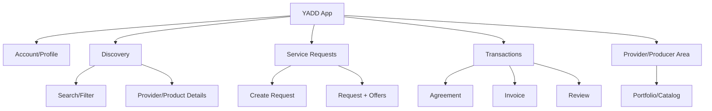

# System Interface Design

> **الحالة:** `DRAFT`

## Interface Hierarchy — Candidate

## Main Interfaces — Draft List

1. Sign in / account setup — depends on Role Model.
2. Home/discovery.
3. Search/filter by category/area.
4. Provider/product detail + portfolio/catalog.
5. Create service request.
6. Request details + offers comparison.
7. Offer/agreement details.
8. Invoice confirmation.
9. Review.
10. Provider portfolio management.
11. Admin interfaces — scope TBD.

## Wireframe Specification Template

لكل شاشة:
- Screen ID.
- Goal.
- Primary actor.
- Related Use Case/FR.
- Required data.
- Main actions.
- Validation/errors.
- Navigation in/out.

لا يلزم Figma قبل تثبيت الشاشات الحرجة، ويمكن لاحقًا تصدير الصور إلى `diagrams/ui/`.
