# System Interface Design

> **الحالة:** `DRAFT FOR PRELIMINARY DEFENSE — SYNCHRONIZED WITH CURRENT USE CASES 2026-09-05`
>
> هذه الوثيقة تصميم مشتق من SRS/Use Cases الحالية. لا تجعل أي شاشة Feature جديدة ولا تثبت UI نهائيًا قبل المراجعة/Usability validation.

## Interface Hierarchy — Current Draft

```mermaid
flowchart TD
    APP[YADD Web Interface]
    APP --> AUTH[Account & Portal Access]
    APP --> DISC[Discovery]
    APP --> REQ[Requests & Provider Responses]
    APP --> COM[Private Communication]
    APP --> TX[Transactions & Invoices]
    APP --> PROF[Provider Profile]
    APP --> SAFE[Safety & Administration]

    AUTH --> SIGNIN[Sign In / Account Setup]
    AUTH --> PORTAL[Beneficiary / Provider Portal]

    DISC --> SEARCH[Search / Filter]
    DISC --> DETAIL[Provider Profile Details]

    REQ --> NEWREQ[Create Request]
    REQ --> REQDETAIL[Request Details]
    REQ --> RESP[Provider Responses / Comparison]

    COM --> CHAT[Private Inquiry / Transaction Chat]

    TX --> TXDETAIL[Transaction Details]
    TX --> INVOICE[Invoice Review / Revision]
    TX --> RATINGS[Post-Completed Ratings]

    PROF --> PPROFILE[Manage Provider Profile]
    PROF --> PORT[Portfolio / Catalog]
    PROF --> VERIFY[Verification Status / Submission]
    PROF --> SUB[Subscription Status]

    SAFE --> REPORT[Block / Report]
    SAFE --> ADMIN[Authorized Admin Review]
```

## Main Interfaces — Draft List

| ID | Interface | Primary Actor | Related Source | Status |
|---|---|---|---|---|
| UI-01 | Sign In / Account Setup | User | FR-001/001A | DRAFT |
| UI-02 | Portal Selection / Switch | User | FR-001A/001B | DRAFT |
| UI-03 | Home / Discovery | Beneficiary | UR-DIS-01 | DRAFT |
| UI-04 | Search / Filter by Category and Area | Beneficiary | FR-003 | DRAFT |
| UI-05 | Provider Profile + Portfolio/Catalog | Beneficiary | FR-PORT-* | DRAFT |
| UI-06 | Create Request | Beneficiary | FR-005..005B | DRAFT |
| UI-07 | Request Details + Provider Responses Comparison | Beneficiary | FR-007..009 | DRAFT |
| UI-08 | Provider Response Create/Edit/Withdraw | Provider | FR-007/007A/007B/007C/007D | DRAFT |
| UI-09 | Private Inquiry / Chat | Beneficiary / Provider | FR-008..008C | DRAFT |
| UI-10 | Direct Transaction Start Confirmation | Beneficiary / Provider | UR-TX-01 / DEC-069 | DRAFT |
| UI-11 | Transaction Details / Cancellation | Beneficiary / Provider | Transaction Use Cases / DEC-048 | DRAFT |
| UI-12 | Create / Revise Final Invoice | Provider | UR-INV-01 / UC-06 | DRAFT |
| UI-13 | Invoice Review — Approve / Request Revision / Complaint | Beneficiary | UR-INV-01 / UR-DSP-01 | DRAFT |
| UI-14 | Rate Provider — Required after Completed | Beneficiary | UR-REV-01 / DEC-051 | DRAFT |
| UI-15 | Rate Beneficiary — Optional after Completed | Provider | UR-REV-02 / DEC-063 | DRAFT |
| UI-16 | Manage Provider Profile / Activities / Service Areas | Provider | FR-002/002B/003C | DRAFT |
| UI-17 | Manage Portfolio / Catalog | Provider | FR-PORT-* | DRAFT |
| UI-18 | Provider Verification Submission / Status | Provider | FR-VER-* | DRAFT / DETAIL POLICY PARTIAL |
| UI-19 | Subscription Status | Provider | FR-SUB-* | DRAFT / COMMERCIAL DETAILS PARTIAL |
| UI-20 | Block / Report | User | UR-SAFE-01 | DRAFT |
| UI-21 | Verification / Reports / Complaint / Subscription Admin Review | Authorized Admin | FR-015/015A/015C | DRAFT / AUTHORIZATION DETAIL PARTIAL |

## Explicitly Removed Stale Screens / Assumptions

- لا توجد شاشة `Agreement` مستقلة لأن Agreement entity/process غير موجود في MVP.
- لا تستخدم كلمة `Offers` كمصطلح قياسي؛ المصطلح `Provider Responses`.
- لا توجد Payment/Wallet/Escrow/Refund/Deposit Amount screens بين Beneficiary وProvider.
- لا يوجد `Review` عام واحد؛ يوجد مساران منفصلان للتقييم بعد `Completed`.
- لا يوجد Guest/anonymous browsing flow معتمد حاليًا.
- لا تعتمد الواجهة على Role Model يفصل Beneficiary Account عن Provider Account؛ User واحد ويمكن أن يملك Provider Profile.

## Critical Flow Constraints for UI

1. Chat وحدها لا تنشئ Transaction.
2. Request Route: اختيار Provider يبدأ Transaction ويغلق Request أمام استجابات جديدة.
3. Direct Search: Transaction Start يحتاج Request + Confirmation من الطرف الآخر.
4. `RequiresDeposit` يعرض Yes/No فقط؛ لا قيمة دفع أو حالة دفع داخل YADD.
5. عدم الرد على Invoice لا يعد Approval.
6. `Completed` هو النجاح النهائي للTransaction؛ Ratings بعدها لا تنشئ `Closed`.
7. unresolved pre-approval dispute يؤدي إلى `Disputed`; لا Ratings بعده.
8. Admin review للنزاع يطبق سياسة YADD فقط ولا يحكم Payment/Refund/Compensation.

## Wireframe Specification Template

لكل شاشة:
- Screen ID.
- Goal.
- Primary actor.
- Related Use Case/FR/Decision.
- Required data.
- Main actions.
- Validation/errors.
- Navigation in/out.
- Open policy dependencies, if any.

## Open / Needs Validation

- تفاصيل التصميم البصري وFigma لا تعتبر معتمدة لمجرد وجودها.
- `UX-VAL-Q01` ما يزال يحتاج Usability/low-connectivity validation.
- أنواع وثائق التحقق والاحتفاظ بها مفتوحة.
- تفاصيل الباقات/الدفع الخارجي للاشتراك مفتوحة.
- صلاحيات الإدارة الفيزيائية والتفصيلية تحتاج Authorization Design.

هذه الوثيقة تحدد hierarchy وظيفية أولية قابلة للتتبع، لا واجهة نهائية أو دليل نجاح UX.
