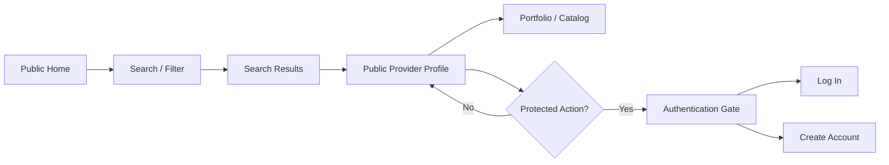
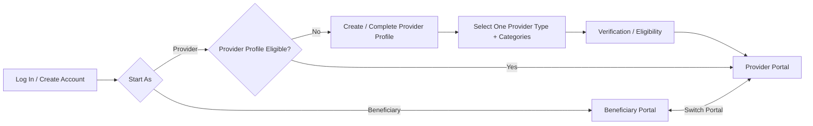
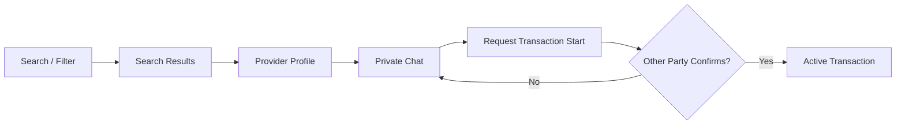
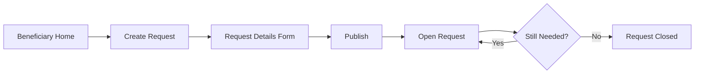
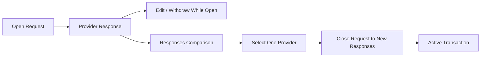
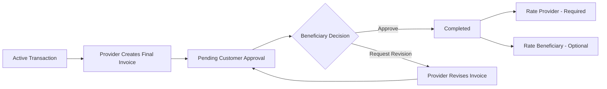
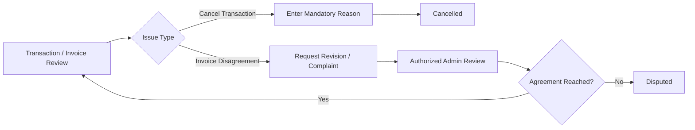
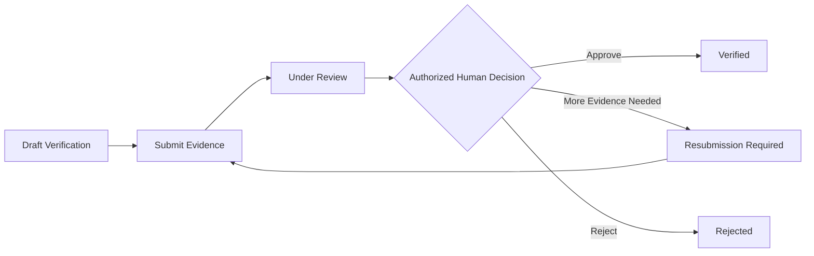
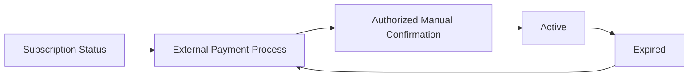
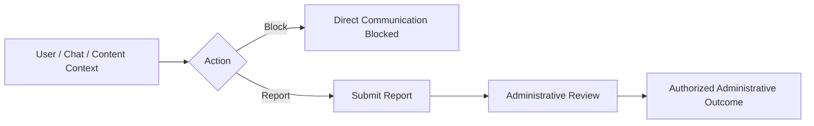

# YADD User Flows — Working Draft

> **Status:** `IN PROGRESS — SOURCE-GROUNDED WORKING DESIGN`
>
> هذه الوثيقة تترجم السلوك المعتمد حاليًا إلى مسارات UX قابلة للتصميم. لا تنشئ Requirements أو Business Rules جديدة، ولا تتغلب على Decision Register أو SRS أو Business Rules أو Use Cases.
>
> **ملاحظة حوكمة:** SRS الحالية `PARTIALLY ANALYZED — NOT BASELINED`. لذلك هذه المسارات صالحة كمدخل تصميم حالي، وليست Baseline نهائية بحد ذاتها.

## 1. Source Basis

المصادر الأساسية المستخدمة:

- `docs/00-governance/02-decision-register.md`
- `docs/03-analysis/05-SRS.md`
- `docs/03-analysis/06-business-rules.md`
- `docs/03-analysis/08-use-cases.md`
- `docs/03-analysis/14-account-portal-model.md`
- `docs/03-analysis/21-provider-verification-model.md`
- `docs/03-analysis/23-provider-subscription-model.md`
- `docs/04-design/03-interface-design.md`
- `docs/04-design/ui-ux/02-screen-inventory.md`

## 2. Status Labels

- **Supported**: المسار أو الانتقال مدعوم مباشرة بقرار/متطلب/Use Case/Business Rule حالي.
- **Derived UX**: انتقال واجهة لازم لتنفيذ وظيفة معتمدة دون إضافة Capability جديدة.
- **Needs Verification**: توجد فجوة سياسة/تفصيل لا يجوز حسمها تصميميًا الآن.

---

# UF-00 — Guest Browse and Protected-Action Gate

- **Status:** Supported.
- **Goal:** تمكين الزائر من اكتشاف Providers قبل إنشاء حساب، مع منع تنفيذ الوظائف المحمية دون Authentication.
- **Primary actor:** Guest.
- **Preconditions:** لا توجد Authentication.
- **Related screens:** `PUB-01 → PUB-02 → PUB-03 → PUB-04 / PUB-05 → PUB-06 → AUTH-01/AUTH-02`.
- **Sources:** UC-00؛ UR-GST-01..03؛ DEC-036/046/064/077؛ ACC-BR-00/09.

## Main success path

1. يدخل Guest إلى Public Home / Discovery.
2. يستخدم Search / Filter حسب التصنيف والمنطقة.
3. يعرض النظام Search Results العامة.
4. يفتح Guest Public Provider Profile.
5. يستعرض البيانات العامة المسموح بها وPortfolio/Catalog.
6. إذا بقي ضمن التصفح العام يستمر دون Authentication.
7. إذا اختار إجراءً محميًا مثل `Create Request` أو `Communicate / Inquire`، يعرض النظام Protected Action Authentication Gate.
8. يختار Guest `Log In` أو `Create Account` قبل تنفيذ الوظيفة المحمية.

## Privacy / authorization boundaries

- لا يعرض Public Provider Profile رقم الهاتف أو وسائل الاتصال الخاصة أو Verification artifacts أو Subscription internals أو Transactions/Invoices/Reports أو بيانات حساسة.
- Guest لا ينشئ Request أو Conversation أو Transaction أو Rating أو Block أو Report قبل Authentication.
- Backend/API يفرض Authentication/Authorization بصورة مستقلة عن ظهور الزر في UI.

## Open / UX detail

- **Derived UX / not a Business Rule:** إعادة المستخدم تلقائيًا إلى الـprotected action المقصود بعد Authentication قد تكون UX convenience، لكن آلية الاستمرار الدقيقة لم تعتمد كقاعدة عمل.

---

# UF-01 — Account, Initial Portal Choice and Portal Switching

- **Status:** Supported.
- **Goal:** استخدام حساب User واحد مع اختيار بوابة البداية وإمكانية الانتقال بين Beneficiary وProvider وفق الأهلية.
- **Primary actor:** User.
- **Related screens:** `AUTH-01/AUTH-02 → AUTH-03 → BEN-01` أو مسار إعداد Provider؛ ثم `AUTH-04` للتبديل.
- **Sources:** DEC-008..011/074/076/077؛ Account & Portal Model؛ SRS Account / Portal Model.

## Main path — first authenticated use

1. ينفذ الشخص Log In أو Create Account.
2. يستخدم النظام هوية `User` واحدة؛ لا ينشئ Beneficiary Account وProvider Account منفصلين.
3. عند تجربة البداية يختار المستخدم بوابة البداية:
   - `Beneficiary Portal`؛ أو
   - `Provider Portal`.
4. اختيار البداية لا يغير نوع الحساب بصورة دائمة.
5. Beneficiary Portal متاحة للمستخدم authenticated دون الحاجة إلى Provider Profile.
6. إذا اختار Provider Portal ولا يوجد Provider Profile مستوفٍ للشروط، يبدأ/يستكمل Provider Profile بدل إنشاء حساب جديد.
7. يختار Provider Profile نوعًا واحدًا فقط في MVP: `SERVICE` أو `PRODUCT`.
8. يختار تصنيفًا واحدًا أو أكثر داخل النوع نفسه؛ يسمح Draft بصفر مؤقتًا، لكن أهلية وظائف التقديم تحتاج تصنيفًا صالحًا واحدًا على الأقل.
9. إذا كان النوع `SERVICE` يجتاز Identity Verification قبل وظائف التقديم؛ إذا كان `PRODUCT` فلا يطلب Government ID، وتبقى شروط Account/Profile eligibility والاشتراك مطبقة.
10. بعد الأهلية يستطيع المستخدم التبديل بين Beneficiary Portal وProvider Portal عبر الحساب نفسه.

## Boundaries

- لا يجوز تصميم اختيار Beneficiary/Provider على أنه إنشاء نوع حساب دائم.
- سياسة تغيير `ProviderProfile.providerType` بعد الاختيار/التفعيل **Needs Verification**؛ لا نصمم Change Type flow نهائيًا الآن.

---

# UF-02 — Direct Search, Inquiry and Transaction Start

- **Status:** Supported.
- **Goal:** العثور على Provider مباشرة، التواصل معه، ثم بدء Transaction رسمي فقط بعد Confirmation.
- **Primary actor:** Beneficiary.
- **Supporting actor:** Provider.
- **Related screens:** `BEN-01/PUB-02 → PUB-03 → PUB-04/PUB-05 → SH-02 → TRX-01 → TRX-02`.
- **Sources:** UC-01؛ UR-DIS-01/UR-PORT-01/UR-COM-01..02/UR-TX-01؛ BR-001/005/007/008/042؛ DEC-069/075.

## Main success path

1. يحدد Beneficiary التصنيف والحي/الفلاتر المتاحة؛ لا يظهر District كحقل مستقل ويُستنتج داخليًا من الحي.
2. يعرض YADD Providers المؤهلين للعرض وفق القواعد الحالية.
3. يفتح Beneficiary Provider Profile ويستعرض Portfolio/Catalog.
4. يبدأ/يفتح التواصل الخاص مع Provider.
5. يناقش الطرفان التفاصيل داخل المحادثة.
6. المحادثة وحدها لا تنشئ Transaction.
7. إذا أراد أحد الطرفين بدء التعامل الرسمي، يرسل `Request Transaction Start` من سياق المحادثة.
8. يعرض النظام للطرف الآخر `Transaction Start Confirmation`.
9. عند التأكيد ينشئ النظام `Active Transaction`.
10. تظهر داخل المحادثة المستمرة فواصل/أحداث نظام توضّح بداية Transaction وحدودها.

## Alternative path

- إذا لم يؤكد الطرف الآخر أو رفض، لا تنشأ Transaction، ويمكن أن تستمر المحادثة أو تتوقف دون تحويلها تلقائيًا إلى معاملة.

## Conversation rule

بين Beneficiary وProvider نفسيهما توجد محادثة واحدة مستمرة يمكن أن ترتبط بعدة Transactions عبر الزمن، مع فواصل/أحداث واضحة لكل Transaction.

---

# UF-03 — Create, Publish and Close Request

- **Status:** Supported.
- **Goal:** تمكين Beneficiary من نشر حاجة لخدمة/منتج بدل البحث عن Provider مباشرة.
- **Primary actor:** Beneficiary.
- **Related screens:** `BEN-01 → BEN-03 → BEN-04 / BEN-02`.
- **Sources:** UC-02؛ UR-REQ-01/02/03/04؛ BR-001/002/018/020/031/052/053؛ DEC-012/013/031/048/049/081.

## Main success path

1. يبدأ Beneficiary `Create Request`.
2. يحدد Service أو Product والفئة المناسبة.
3. يختار الحي في الواجهة؛ يستنتج النظام المديرية داخليًا من الحي المختار وفق نموذج الموقع الحالي.
4. يضيف وصفًا حرًا.
5. يمكنه إضافة صور ومعلومات إضافية اختيارية.
6. يمكنه إضافة سعر استرشادي اختياري.
7. ينشر الطلب ويصبح `Open`.
8. يوزع النظام الطلب وفق قواعد النشاط والمنطقة الحالية.

## Alternative — no longer needed

- قبل اختيار Provider يستطيع Beneficiary إغلاق الطلب إذا لم يعد يحتاجه.
- هذا `Request Closure` وليس `Transaction Cancellation`.

## Request expiry and location policy

- Reminder بعد 24h ثم 48h، ثم `Expired` عند 72h من عدم نشاط Beneficiary؛ Republish ينشئ Request جديدًا — DEC-081.
- **Approved UI Decision:** واجهات المستخدم تعرض/تطلب الحي فقط؛ المديرية لا تظهر كحقل مستقل وتُستنتج داخليًا من الحي مع بقاء نموذج `District + Neighborhood` في طبقة البيانات/القواعد.
- التوسع إلى الأحياء المجاورة يحتاج موافقة Beneficiary؛ بيانات الجوار والتوقيت التشغيلي ما تزال مفتوحة.
- **Needs Verification — LOC-DATA-Q01:** قائمة الأحياء وربط كل حي بمديريته يجب التحقق منها قبل التنفيذ.

---

# UF-04 — Provider Response, Comparison and Selection

- **Status:** Supported.
- **Goal:** استقبال Provider Responses ومقارنتها واختيار Provider واحد لبدء Transaction.
- **Primary actors:** Eligible Provider, Beneficiary.
- **Related screens:** `PRO-02 → PRO-03 → PRO-04/PRO-05 → SH-02 → BEN-04 → BEN-05/BEN-06 → BEN-07 → TRX-02`.
- **Sources:** UC-03/UC-04؛ UR-OFF-01..03؛ BR-003/004/006/030/033/039؛ DEC-014/041/043/047/066/070.

## Provider response path

1. Eligible Provider يفتح Suitable Request وهو `Open`.
2. يراجع تفاصيل الطلب.
3. ينشئ Provider Response.
4. يمكنه قبول السعر الاسترشادي أو اقتراح سعر آخر وإضافة ملاحظة.
5. يحدد `RequiresDeposit = Yes/No` فقط.
6. لا يطلب YADD Deposit amount أو percentage أو payment status أو refund data.
7. لكل Provider استجابة فعالة واحدة فقط لكل Request.
8. ما دام Request `Open` ولم يتم الاختيار، يستطيع Provider تعديل الاستجابة أو سحبها.
9. يمكن للطرفين استخدام Chat قبل الاختيار.

## Beneficiary comparison / selection path

1. يفتح Beneficiary Request Details.
2. يعرض النظام Provider Responses المتاحة.
3. يقارن Beneficiary الاستجابات والمحادثات ذات الصلة و`RequiresDeposit` إن وجدت.
4. يختار Provider واحدًا.
5. يغلق النظام الطلب أمام استجابات جديدة.
6. تصبح الاستجابة المختارة `Selected` والبقية `NotSelected`.
7. ينشئ النظام `Active Transaction` مباشرة في Request Route.

## Explicit exclusion

- لا توجد `Agreement` screen/entity مستقلة بين Selection وTransaction.

---

# UF-05 — Transaction, Final Invoice, Completion and Ratings

- **Status:** Supported.
- **Goal:** إكمال التعامل الرسمي بسجل فاتورة نهائي ثم التقييم بعد `Completed`.
- **Primary actors:** Provider, Beneficiary.
- **Related screens:** `TRX-02 → INV-01 → INV-02 → RAT-01 / RAT-02`.
- **Sources:** UC-06/UC-07/UC-07B؛ BR-009..016؛ DEC-015/016/025/050/051/055/063/071.

## Main success path

1. توجد `Active Transaction` بين الطرفين.
2. بعد التنفيذ/التجهيز واستقرار البنود ينشئ Provider Final Invoice.
3. تتضمن الفاتورة البنود والأسعار والإجمالي وصورًا اختيارية حسب القواعد الحالية.
4. يرسل Provider الفاتورة.
5. تصبح الفاتورة `Pending Customer Approval`.
6. يراجع Beneficiary الفاتورة.
7. إذا اختار `Approve` تصبح Transaction `Completed`.
8. تحفظ الفاتورة المعتمدة كسجل YADD النهائي للمعاملة.
9. بعد `Completed` يطلب النظام من Beneficiary تقييم Provider من 1–5 نجوم؛ التعليق اختياري.
10. بعد `Completed` يعرض النظام للمقدم تقييم Beneficiary اختياريًا عبر المؤشرات الثلاثة المعتمدة.
11. Ratings عمليات Post-Transaction ولا تغير حالة `Completed`.

## Revision path

1. يختار Beneficiary `Request Revision` مع ملاحظة.
2. يعدل Provider الفاتورة ويرسل نسخة جديدة.
3. يحتفظ النظام بتاريخ النسخ.
4. تعود النسخة الجديدة للمراجعة.

## No response

- عدم رد Beneficiary لا يعد Approval.
- تبقى الفاتورة Pending وتصل تذكيرات.
- بعد 24h Reminder، بعد 48h Reminder ثانٍ، وبعد 72h تصبح الفاتورة Overdue دون Auto-Approval.

## Financial boundary

- YADD لا ينفذ أو يحتفظ أو يتحقق من Payment بين Beneficiary وProvider.
- لا Escrow/Refund/Settlement lifecycle داخل هذا flow.

---

# UF-06 — Transaction Cancellation and Unresolved Invoice Dispute

- **Status:** Supported; some long-running policy remains open.
- **Goal:** فصل الإلغاء العادي عن خلاف الفاتورة غير المحلول وعدم إعطاء الإدارة صلاحيات مالية غير معتمدة.
- **Primary actors:** Beneficiary, Provider; Authorized Admin عند الشكوى.
- **Related screens:** `TRX-02 → cancellation state` أو `INV-02 → SAFE-02 → ADM-05`.
- **Sources:** UC-05؛ UC-06 dispute alternative؛ BR-013/018/019/040؛ DEC-025/048/073.

## Cancellation path

1. بعد بدء Transaction يختار أحد الطرفين إلغاء المعاملة.
2. يدخل سببًا إلزاميًا.
3. يسجل YADD السبب والطرف والتوقيت.
4. يظهر السبب للطرف الآخر.
5. تصبح Transaction `Cancelled`.
6. لا Ratings بعد `Cancelled`.

## Invoice complaint / dispute path

1. أثناء Invoice Review، إذا استمرت المشكلة قبل Approval يستطيع Beneficiary رفع Complaint.
2. تراجع الإدارة الأدلة الموجودة داخل YADD لتطبيق سياسات المنصة.
3. الإدارة قد تتخذ إجراءً إداريًا عند وجود مخالفة وفق صلاحياتها.
4. الإدارة لا تحكم باستحقاق Payment/Refund/Compensation ولا تلزم أحدًا بدفع أو استرداد مبلغ.
5. Complaint بحد ذاتها لا تحول Transaction تلقائيًا إلى `Disputed`.
6. إذا بقي الخلاف قبل اعتماد الفاتورة دون اتفاق نهائي تصبح Transaction `Disputed` كحالة نهائية غير ناجحة.
7. لا Ratings بعد `Disputed`.

## Open policy

- تفاصيل التصعيد الزمني الطويل للفواتير المعلقة ما تزال `Needs Verification`.

---

# UF-07 — Provider Verification and Human Review

- **Status:** Supported with open retention/legal detail.
- **Goal:** إدارة Government-ID Identity Verification الخاصة بـService Provider فقط مع مراجعة بشرية نهائية.
- **Primary actor:** Service Provider.
- **Supporting actor:** Verification Reviewer.
- **Related screens:** `PRO-09 → PRO-10 → ADM-02 → ADM-03 → PRO-09`.
- **Sources:** Provider Verification Model؛ DEC-035/085؛ FR-VER-01..06؛ BR-027/028/060/061؛ SRS Verification Model.

## Main path

1. يكون Service Provider Profile في حالة تحتاج التحقق من الهوية.
2. يفتح Service Provider شاشة Verification Status / Submission.
3. يرفع الحد الأدنى المعتمد حاليًا:
   - official identity document؛
   - personal photo with the document؛
   - account data اللازمة للمطابقة.
4. يرسل الطلب: `Draft → Submitted → UnderReview` مفاهيميًا.
5. قد تنفذ طبقة AI/automated checks فحوصًا مساعدة وتنتج Flags.
6. يراجع موظف YADD مخول البيانات والنتائج المساعدة.
7. القرار النهائي البشري يكون أحد:
   - `Verified`؛
   - `ResubmissionRequired`؛
   - `Rejected`.
8. عند ResubmissionRequired يسجل الموظف ملاحظة/سبب، ويستطيع Provider إعادة التقديم.
9. رفع الوثائق وحده لا يفعّل وظائف Service Provider التي تتطلب Identity Verified تلقائيًا.
10. أثناء انتظار Service Provider Identity Verification يستطيع الحساب الاستمرار كمستفيد، لكنه لا يستخدم وظائف Service Provider التي تتطلب Identity Verified.
11. Product Provider خارج هذا Government-ID flow في MVP؛ يعتمد على Account/Profile eligibility ولا يعرض Identity Verified badge.

## Sensitive-data boundary

- Verification artifacts غير عامة.
- الوصول لها محصور بالموظفين المخولين مع متطلبات Audit/Security.

## Needs Verification

- مدة الاحتفاظ ببيانات التحقق.
- الأنشطة التي قد تحتاج ترخيصًا مهنيًا إضافيًا.

---

# UF-08 — Provider Subscription Status and Manual Confirmation

- **Status:** Supported with commercial/operational details open.
- **Goal:** إدارة أهلية إرسال Provider Responses عبر اشتراك يديره YADD لكن تحصيله خارجي.
- **Primary actor:** Provider.
- **Supporting actor:** Subscription Administrator.
- **Related screens:** `PRO-11 → ADM-06 → ADM-07 → PRO-11`.
- **Sources:** Provider Subscription Model؛ DEC-021/042/043/086؛ FR-SUB-01..06؛ BR-026/029/030.

## Conceptual flow

1. يعرض النظام Subscription Status للمقدم.
2. التحصيل المالي للاشتراك يتم خارج YADD وفق الإجراء التشغيلي المعتمد لاحقًا.
3. موظف YADD مخول يتحقق تشغيليًا ويؤكد التفعيل/التجديد يدويًا داخل YADD.
4. الحالة المفاهيمية تنتقل `PendingConfirmation → Active` بعد التأكيد.
5. عند الوصول إلى EndDate تصبح `Expired`.
6. يمكن العودة إلى `Active` بعد تجديد وتأكيد مخول جديد.
7. إرسال Provider Responses جديدة يتطلب Subscription `Active` + أهلية النوع: Service Provider = Identity Verified؛ Product Provider = Account/Profile eligible دون Government-ID Verification.
8. عند `Expired` يمنع إرسال Provider Responses جديدة وبدء Direct Transaction جديدة حتى التجديد، بينما تستمر Transactions القائمة ويمكن للمقدم تسجيل الدخول.

## Needs Verification

- أسماء/عدد/أسعار/مدد الباقات.
- وسائل الدفع الخارجي المقبولة وإثباته.
- الأثر الدقيق لانتهاء الاشتراك على الظهور في Search وعلى Transactions الجارية.

---

# UF-09 — Block and Report / Administrative Review

- **Status:** Supported.
- **Goal:** تمكين المستخدم من وقف التواصل مباشرة أو إرسال بلاغ للمراجعة دون اعتبار البلاغ إدانة تلقائية.
- **Primary actor:** User.
- **Supporting actor:** Authorized Admin / Content Moderator as applicable.
- **Related screens:** `PUB-04/SH-02/TRX-02/Portfolio Item context → SAFE-01 or SAFE-02 → ADM-04 → ADM-05`.
- **Sources:** UC-08؛ BR-022/028؛ DEC-053/054؛ current Trust & Safety model.

## Block path

1. User authenticated يختار Block للطرف الآخر من سياق مناسب.
2. يوقف Block التواصل المباشر وفق قاعدة النظام.
3. Block مستقل عن Report؛ لا يتطلب إنشاء Report تلقائيًا.

## Report path

1. User authenticated ينشئ Report مرتبطًا بمستخدم/محادثة/سلوك أو Portfolio/Catalog Item حسب السياق المدعوم.
2. يرسل النظام Report للمراجعة الإدارية.
3. Report لا يعد إثباتًا نهائيًا لمخالفة.
4. يمكن أن تدعم AI Flags المراجعة، لكنها لا تصدر وحدها عقوبة نهائية عالية الأثر.
5. يقرر الموظف المخول الإجراء الإداري وفق السياسة والصلاحيات الحالية.

## Boundary

- Guest لا ينفذ Block/Report قبل Authentication.
- لا نفترض تلقائيًا أن Block = Report أو Report = punishment.

---

# 3. Cross-Flow Constraints

هذه القيود يجب أن تبقى صحيحة في جميع wireframes والواجهات:

1. Guest = public browse/search/view only؛ protected actions require Authentication.
2. User واحد يمكنه استخدام Beneficiary وProvider Portals؛ لا حسابان منفصلان.
3. Provider Profile في MVP من نوع واحد فقط `SERVICE` أو `PRODUCT`.
4. Chat وحدها لا تنشئ Transaction.
5. Request Route: Provider Selection يبدأ Transaction مباشرة ويغلق Request أمام Responses جديدة.
6. Direct Search Route: Transaction Start يحتاج Confirmation من الطرف الآخر.
7. Provider Response تعرض `RequiresDeposit Yes/No` فقط؛ لا Deposit amount/payment/refund lifecycle.
8. Final Invoice المعتمدة هي سجل المعاملة النهائي داخل YADD؛ YADD لا يعالج دفع Beneficiary↔Provider.
9. عدم الرد على Invoice لا يعد Approval.
10. `Completed` هي النهاية الناجحة للTransaction، وRatings تأتي بعدها ولا تغير الحالة.
11. لا Ratings بعد `Cancelled` أو `Disputed`.
12. Verification final decision بشري؛ AI مساعد فقط.
13. Provider Responses الجديدة تحتاج Active Subscription + أهلية النوع: Service Provider = Identity Verified؛ Product Provider = Account/Profile eligible دون Government-ID Verification.
14. Public Provider Profile لا يكشف private direct-contact أو sensitive verification data.
15. Block وReport عمليتان مستقلتان.
16. **Neighborhood-only UI:** في واجهات الموقع يختار/يرى المستخدم الحي فقط؛ District مشتق داخليًا ولا يُعرض كحقل مستقل، مع بقاء LOC-DATA-Q01 للتحقق من الربط.

# 4. Design Decisions Still Not Authorized by These Flows

لا يجوز اعتبار الآتي محسومًا لمجرد وجود هذه الوثيقة:

- شكل Navigation النهائي وعدد tabs.
- هل بعض الحالات Page أو Modal أو Sheet.
- آلية exact return-to-intended-action بعد Authentication.
- ترتيب Search ranking أو recommendation algorithm.
- أنواع وثائق Verification التفصيلية وسياسة retention.
- Subscription plans/prices/external-payment evidence procedure.
- أثر Expired subscription على search visibility أو already-active Transactions.
- Admin physical permission matrix beyond the currently approved role concepts.
- Visual UI direction أو نجاحه قبل usability validation.

# 5. Next Design Step

بناء Wireflows منخفضة الدقة بالترتيب التالي:

1. `UF-00` Guest Browse + Gate.
2. `UF-02` Direct Search → Chat → Transaction Start.
3. `UF-03 + UF-04` Request → Responses → Selection.
4. `UF-05 + UF-06` Transaction → Invoice → Completion / Revision / Dispute.
5. `UF-07` Verification.
6. `UF-08` Subscription.
7. `UF-09` Safety/Admin review.

كل Wireflow يجب أن يستخدم IDs من `02-screen-inventory.md` ويحافظ على traceability إلى المصادر أعلاه.